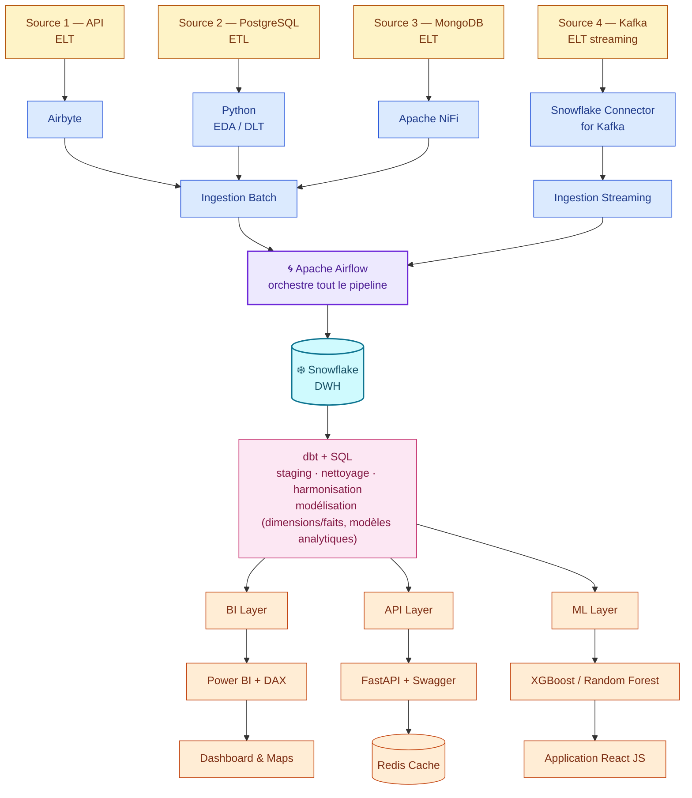

<div align="center">

# 🌾 Assaman & Suuf

### *« Ciel & Terre »* — Agroclimatologie & Aide à la décision agricole au Sénégal

[](https://www.python.org/)
[](https://airflow.apache.org/)
[](https://www.snowflake.com/)
[](https://www.getdbt.com/)
[](https://fastapi.tiangolo.com/)
[](https://powerbi.microsoft.com/)
[](https://react.dev/)
[](#)
[](#-licence)
[](#-méthodologie)

</div>

---

## 📖 Sommaire

- [À propos](#-à-propos)
- [Objectifs](#-objectifs)
- [Architecture](#-architecture)
- [Stack technique](#-stack-technique)
- [Livrables](#-livrables)
- [Méthodologie](#-méthodologie)
- [Démarrage rapide](#-démarrage-rapide)
- [Structure du projet](#-structure-du-projet)
- [Stratégie de branches & contribution](#-stratégie-de-branches--contribution)
- [Équipe](#-équipe)
- [Licence](#-licence)

---

## 🌍 À propos

**Assaman & Suuf** — *le ciel et la terre*, en wolof — est un projet d'agroclimatologie qui croise données climatiques et données agricoles pour mieux comprendre comment le ciel façonne les rendements de la terre, au Sénégal.

Le projet vise à :
- 🔍 Identifier les **anomalies climatiques** et suivre leur évolution dans le temps
- 🌱 Analyser leur **relation avec les rendements agricoles**
- 📊 Fournir des **éléments concrets d'aide à la décision** aux acteurs agricoles

Les sources de données mobilisées sont volontairement hétérogènes — formats, fréquences, niveaux géographiques et granularités différents — ce qui impose une architecture pensée pour absorber cette diversité avant toute analyse.

## 🎯 Objectifs

| Objectif | Description |
|---|---|
| Comprendre | Croiser météo/climat et performance agricole pour en dégager des tendances |
| Détecter | Repérer les anomalies climatiques significatives dans le temps |
| Prédire | Estimer le rendement d'une culture à partir de facteurs climatiques |
| Décider | Donner aux acteurs agricoles une vision claire par région et par culture |

## 🏗️ Architecture



## 🛠️ Stack technique

| Couche | Outils |
|---|---|
| **Ingestion** | Airbyte, Apache NiFi, Python (EDA/DLT), Snowflake Connector for Kafka |
| **Orchestration** | Apache Airflow |
| **Stockage & Transformation** | Snowflake (DWH), dbt + SQL |
| **BI** | Power BI, DAX |
| **API** | FastAPI, Swagger, Redis (cache) |
| **Machine Learning** | XGBoost, Random Forest |
| **Frontend** | React JS |
| **Gestion de projet** | Scrum, Trello |
| **Versioning** | Git / GitHub |

## 📦 Livrables

- 📊 **Dashboard Power BI** alimenté par Snowflake, avec carte interactive et filtres géographiques
- 🔌 **API FastAPI** documentée via Swagger
- 🤖 **Modèle de prédiction des rendements**, exposé dans une interface applicative
- 🗺️ **Carte interactive** intégrée au dashboard

## 🔁 Méthodologie

Le projet est piloté en **Scrum**, avec un board Trello organisé par étiquettes :

`01 Analyse` · `02 Visualisation` · `03 Data` · `04 Documentation` · `05 Dev` · `06 ML`

**Sprint 1 — Cadrage, socle technique & données**

| Axe | User Stories |
|---|---|
| Cadrage | US01 Dashboard · US04 API · US07 Prédiction · US11 Cartographie |
| Technique | US14 Git/GitHub · US15 CI/CD |
| Données | US16 Récupération · US17 Préparation |

### ✅ Checklist — Sprint 1

- [ ] US14 — Mettre en place le dépôt Git/GitHub
- [ ] US01 — Définir les besoins du Dashboard
- [ ] US04 — Définir les besoins des API
- [ ] US07 — Définir le problème de prédiction
- [ ] US11 — Définir les besoins cartographiques
- [ ] US15 — Mettre en place le CI/CD
- [ ] US16 — Récupération des données
- [ ] US17 — Préparation des données

## 🚀 Démarrage rapide

```bash
# 1. Cloner le repo
git clone https://github.com/<org>/assaman-suuf.git
cd assaman-suuf

# 2. Créer l'environnement virtuel
python -m venv venv
source venv/bin/activate

# 3. Installer les dépendances
pip install -r requirements.txt

# 4. Copier le fichier d'environnement
cp .env.example .env
# → renseigner les identifiants Snowflake, PostgreSQL, MongoDB, Kafka
```

## 📁 Structure du projet

```
assaman-suuf/
├── ingestion/          # Scripts d'ingestion par source (API, PostgreSQL, MongoDB, Kafka)
├── dbt_project/        # Modèles dbt (staging, intermediate, marts)
├── api/                # Application FastAPI
├── ml/                 # Entraînement et sérialisation des modèles
├── dashboard/          # Fichiers Power BI (.pbix) et documentation DAX
├── docs/                # Documentation du projet
├── .gitignore
├── requirements.txt
└── README.md
```

## 🌿 Stratégie de branches & contribution

- **`main`** — version stable, protégée, jamais de push direct
- **`develop`** — branche d'intégration, protégée, jamais de push direct
- **`feature/nom-de-la-tache`** — une branche par tâche, créée depuis `develop`

```bash
git checkout develop
git pull
git checkout -b feature/ma-tache
# ... travail, commits ...
git push -u origin feature/ma-tache
# → ouvrir une Pull Request vers develop, faire valider par un·e coéquipier·ère
```

**Convention de commits** : `feat:`, `fix:`, `docs:`, `refactor:`, `test:`
**Règle de PR** : toute Pull Request doit être revue et approuvée par au moins une autre personne avant merge.

## 👥 Équipe

| Membre | Rôle | LinkedIn |
| :--- | :--- | :--- |
| **Abdoulaye Djigo** | Data Engineer · DevOps · Lead Technique | [Profil](https://www.linkedin.com/in/abdoulaye-djigo-9898241b6/) |
| **Ndèye Khady Mbaye** | Scrum Master · Data Analyst BI | [Profil](https://www.linkedin.com/in/ndeye-khady-mbaye/) |
| **Aby Faye** | Data Engineer · Coordonnatrice d'équipe · Assistante Product Owner | [Profil](https://www.linkedin.com/in/aby-f-1399b8269/) |
| **Ibrahima Niass Diouf** | Product Owner · Data Scientist ML/IA | [Profil](https://www.linkedin.com/in/ibrahima-niasse-diouf-b8b837310/) |
| **Anthony Exaucé M.** | Développeur Full Stack | [Profil](https://www.linkedin.com/in/anthony-exauc%C3%A9-m-727087374/) |

*Projet réalisé dans le cadre du programme Dev Data P8 — Sonatel Académie / Orange Digital Center, Dakar.*

## 📄 Licence

Ce projet est distribué sous licence MIT — voir le fichier [`LICENSE`](LICENSE) pour plus de détails.

---

<div align="center">

*Du ciel à la terre, des données à la décision.* 🌾

</div>