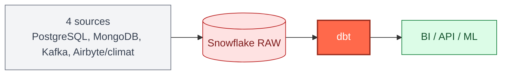
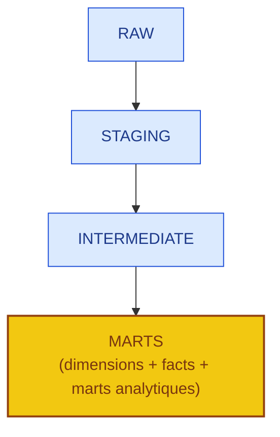
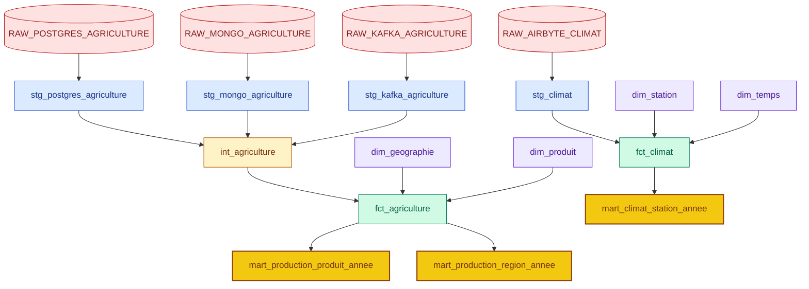
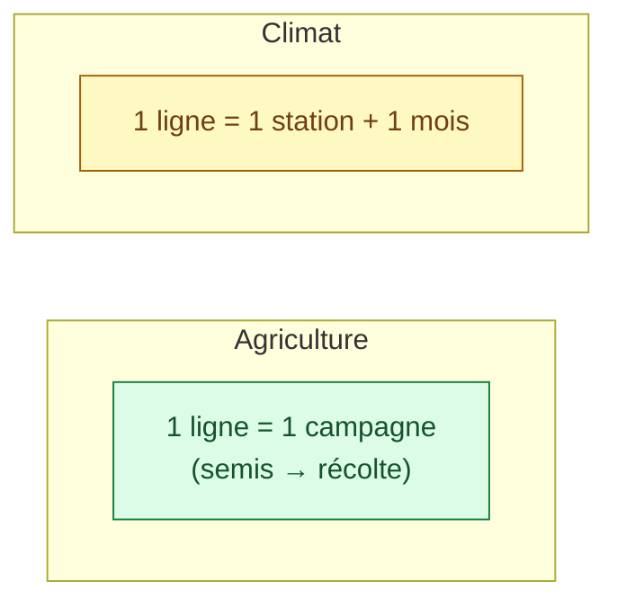
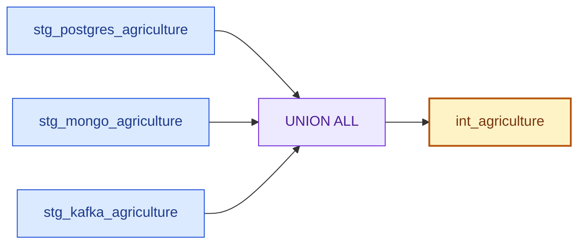
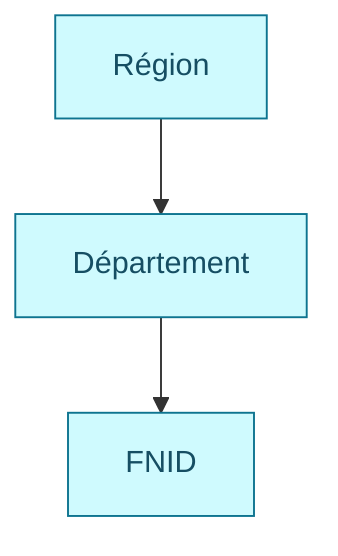
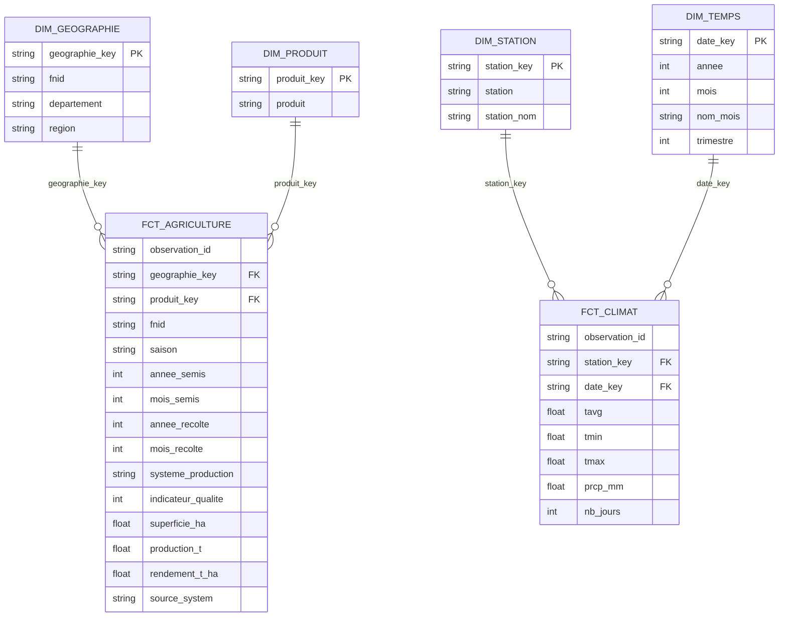
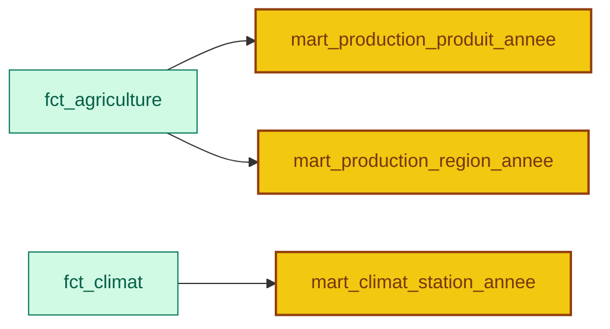
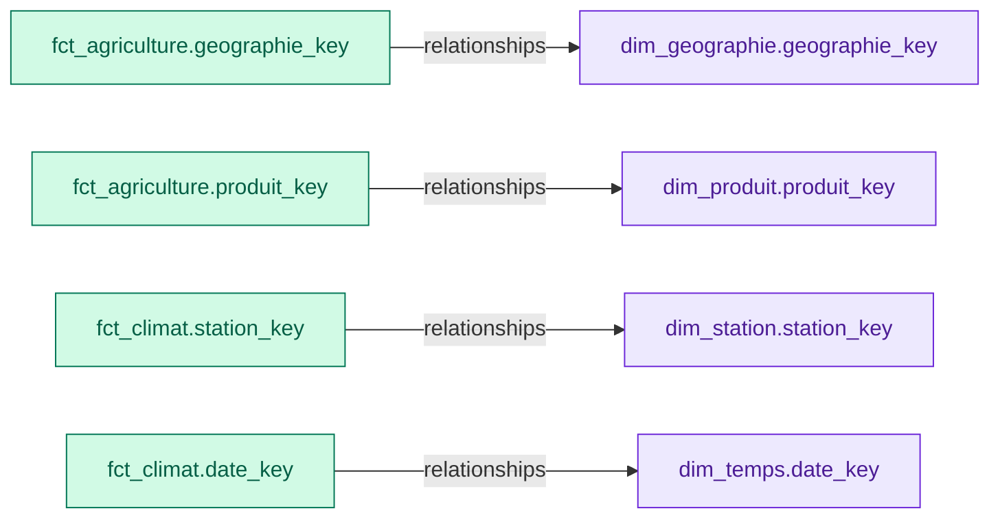
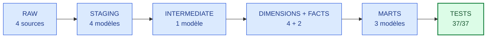

<div align="center">

# DataFlow360 — dbt : transformation et modélisation

### De la zone RAW aux modèles analytiques — Assaman & Suuf

[](#)
[](#)
[](#)
[](#)
[](#)

> Ce README documente l'architecture dbt **actuelle** du projet. Elle remplace les anciennes dimensions `dim_annee` et `dim_zone`, retirées du projet.

</div>

---

## Sommaire

- [1. Pourquoi dbt, et pourquoi après RAW](#1-pourquoi-dbt-et-pourquoi-après-raw)
- [2. Architecture en couches](#2-architecture-en-couches)
- [3. Agriculture et climat ne se modélisent pas pareil](#3-agriculture-et-climat-ne-se-modélisent-pas-pareil)
- [4. Sources RAW](#4-sources-raw)
- [5. Staging](#5-staging)
- [6. Intermediate — `int_agriculture`](#6-intermediate--int_agriculture)
- [7. Dimensions](#7-dimensions)
- [8. Tables de faits](#8-tables-de-faits)
- [9. Marts analytiques](#9-marts-analytiques)
- [10. Tests](#10-tests)
- [11. Organisation des fichiers](#11-organisation-des-fichiers)
- [12. Commandes dbt](#12-commandes-dbt)
- [13. Ce qui a changé depuis l'ancienne architecture](#13-ce-qui-a-changé-depuis-lancienne-architecture)
- [14. État final](#14-état-final)

---

## 1. Pourquoi dbt, et pourquoi après RAW

dbt (data build tool) transforme les données **à l'intérieur de Snowflake**, en SQL, par couches successives. Il intervient volontairement *après* l'ingestion (RAW) et non à la place : chaque outil d'ingestion (Airbyte, NiFi, pipeline Postgres, Kafka Connector) a pour seul rôle de déposer la donnée brute dans Snowflake sans la transformer. dbt prend le relais une fois la donnée arrivée, pour que toute la logique de nettoyage, d'harmonisation et de modélisation soit écrite au même endroit, versionnée, testée et relisible — plutôt qu'éparpillée dans quatre scripts d'ingestion différents.



---

## 2. Architecture en couches



| Couche | Rôle | Pourquoi elle existe |
|---|---|---|
| **RAW** | Donnée brute, non modifiée | Garder une copie fidèle de ce que chaque source a réellement envoyé, pour pouvoir toujours revenir en arrière |
| **STAGING** | Nettoyage et typage, source par source | Isoler les particularités de chaque source (JSON Kafka, types MongoDB...) avant de les faire se ressembler |
| **INTERMEDIATE** | Consolidation entre sources | Fusionner les 3 sources agricoles en une seule structure commune, sans encore faire de calculs métier |
| **MARTS** | Dimensions, faits, agrégats | Donner aux dashboards et aux analyses une structure prête à l'emploi (schéma en étoile) |



---

## 3. Agriculture et climat ne se modélisent pas pareil

C'est le point le plus important à comprendre avant de lire le reste : les deux domaines n'ont pas le même **grain** (le niveau de détail d'une ligne), donc ils ne partagent ni la même dimension temps ni la même dimension géographique.

### Agriculture — une ligne = une campagne, pas un mois

Une ligne agricole représente une **observation / campagne agricole** : FNID, région, département, produit, saison, année et mois de semis, année et mois de récolte, système de production, superficie, production, rendement.

**Pourquoi ce n'est pas une table mensuelle.** Les mois de semis et de récolte sont des **attributs de la campagne** (quand elle a commencé, quand elle s'est terminée) — ils ne signifient pas qu'il existe une observation pour chaque mois entre les deux. `fct_agriculture` reste donc au grain de la campagne, pas du mois.

### Climat — une ligne = une mesure mensuelle

Les données climatiques sont, elles, réellement mensuelles. Le grain de `fct_climat` est :

```text
1 station + 1 année + 1 mois
```



C'est pour cette raison que la dimension temps du climat (`dim_temps`, granularité année + mois) est différente de la logique temporelle de l'agriculture (qui reste au niveau de la campagne, via `annee_semis`/`annee_recolte` directement dans `fct_agriculture`).

---

## 4. Sources RAW

Quatre tables RAW alimentent dbt, déclarées dans `models/staging/sources.yml` :

```yaml
version: 2
sources:
  - name: raw
    database: DATAFLOW360
    schema: RAW
    tables:
      - name: raw_postgres_agriculture
      - name: raw_mongo_agriculture
      - name: raw_kafka_agriculture
      - name: raw_airbyte_climat
```

Déclarer les sources plutôt que d'écrire le chemin en dur permet à un modèle d'écrire :

```sql
{{ source('raw', 'raw_postgres_agriculture') }}
```

au lieu de `DATAFLOW360.RAW.RAW_POSTGRES_AGRICULTURE` — un seul endroit à corriger si une table RAW change de nom.

---

## 5. Staging

### 5.1 Agriculture

Les trois sources agricoles restent **séparées** à ce stade : `stg_postgres_agriculture`, `stg_mongo_agriculture`, `stg_kafka_agriculture`. Elles ne sont réunies qu'en `INTERMEDIATE` (section 6) — le Staging s'occupe uniquement de nettoyer chaque source dans son propre format, sans encore les comparer entre elles.

### 5.2 Climat — `stg_climat`

```sql
SELECT
    id::INTEGER         AS id,
    TRIM(station)        AS station,
    TRIM(station_nom)    AS station_nom,
    annee::INTEGER       AS annee,
    mois::INTEGER        AS mois,
    tavg::FLOAT          AS tavg,
    tmin::FLOAT          AS tmin,
    tmax::FLOAT          AS tmax,
    prcp_mm::FLOAT       AS prcp_mm,
    nb_jours::INTEGER    AS nb_jours
FROM {{ source('raw', 'raw_airbyte_climat') }}
```

Contient : `id`, `station`, `station_nom`, `annee`, `mois`, `tavg`, `tmin`, `tmax`, `prcp_mm`, `nb_jours`.

---

## 6. Intermediate — `int_agriculture`

**Pourquoi cette couche.** Les trois sources agricoles partagent la même structure conceptuelle mais restent trois flux distincts après le Staging. `int_agriculture` leur donne une base commune unique — toute règle de fusion ne se corrige qu'à un seul endroit, pas trois.

**Comment.** Les trois modèles Staging agricoles sont assemblés avec `UNION ALL` (pas `UNION` : le diagnostic préalable a confirmé l'absence de chevauchement entre sources, il n'y a donc rien à dédupliquer).



Deux colonnes ajoutées à cette étape :

| Colonne | Rôle | Pourquoi |
|---|---|---|
| `source_system` | `POSTGRES` / `MONGO` / `KAFKA` | Garder la trace de l'origine de chaque ligne même après fusion, pour isoler un problème propre à une seule source |
| `annee_reference` | `annee_recolte`, sinon `annee_semis` | Donner une année unique utilisable pour toutes les analyses temporelles agricoles |

`int_agriculture` sert ensuite de base commune à `fct_agriculture` (section 8).

---

## 7. Dimensions

Quatre dimensions, créées dans le schéma `MARTS`.

| Dimension | Remplace | Contenu | Rôle |
|---|---|---|---|
| `dim_geographie` | `dim_zone` | `geographie_key`, `fnid`, `departement`, `region` | Où se situe une observation agricole |
| `dim_produit` | — | `produit_key`, `produit` | Quel produit est concerné |
| `dim_temps` | `dim_annee` | `date_key`, `annee`, `mois`, `nom_mois`, `trimestre` | Quand une observation climatique a été mesurée |
| `dim_station` | — | `station_key`, `station`, `station_nom` | Quelle station climatique a produit l'observation |

### 7.1 `dim_geographie` — pourquoi elle remplace `dim_zone`

Elle représente la hiérarchie géographique **réellement présente** dans les données, du niveau le plus large au plus précis :



`geographie_key` est générée à partir du FNID, et utilisée par `fct_agriculture` pour relier chaque observation à sa géographie.

### 7.2 `dim_temps` — pourquoi elle remplace `dim_annee`, et pourquoi ce n'est pas un calendrier généré

`dim_annee` ne couvrait qu'une granularité annuelle, insuffisante pour le climat (mensuel). `dim_temps` la remplace avec une granularité année + mois.

**Point important :** cette dimension n'est **pas** un calendrier complet généré artificiellement (du type « toutes les dates de 1960 à 2025 »). Elle est construite uniquement à partir des couples `année + mois` **réellement présents** dans les données climatiques — pas de ligne pour un mois qui n'a jamais été observé.

La clé est construite au format `YYYYMM`, par exemple `201507` pour juillet 2015.


Cette dimension sert à `fct_climat` et à `mart_climat_station_annee`. **Elle n'est pas utilisée par l'agriculture**, qui reste au grain de la campagne (section 3).

### 7.3 `dim_station` — pourquoi elle reste indépendante de la géographie agricole

`dim_station` représente les stations météorologiques, sans lien avec `dim_geographie`.

**Pourquoi ne pas les relier.** Aucune relation fiable entre une station climatique et un FNID agricole n'a été établie dans les données actuelles. Inventer un lien `station → FNID` donnerait une fausse impression de précision géographique — une station n'est pas automatiquement représentative de la zone agricole qui l'entoure. Ce lien n'existe donc ni dans le modèle ni dans ce README.

---

## 8. Tables de faits

### 8.1 `fct_agriculture`

**Grain :** 1 observation agricole / campagne.

Contient : `observation_id`, `geographie_key`, `produit_key`, `fnid`, `saison`, `annee_semis`, `mois_semis`, `annee_recolte`, `mois_recolte`, `systeme_production`, `indicateur_qualite`, `superficie_ha`, `production_t`, `rendement_t_ha`, `source_system`.

**Point important sur `observation_id` :** cette clé technique est générée à partir des attributs de l'observation, mais elle **n'est pas présentée comme une clé métier garantie unique** — des doublons existent dans certaines sources (voir le diagnostic initial sur les événements multiples Kafka). `observation_id` identifie une ligne, pas une garantie d'unicité métier.

### 8.2 `fct_climat`

**Grain :** 1 station + 1 année + 1 mois.

Contient : `observation_id`, `station_key`, `date_key`, `tavg`, `tmin`, `tmax`, `prcp_mm`, `nb_jours`.

Relations :

```text
station_key → dim_station.station_key
date_key    → dim_temps.date_key
```

### 8.3 Modèle en étoile obtenu



---

## 9. Marts analytiques

| Mart | Granularité | Indicateurs | Détail |
|---|---|---|---|
| `mart_production_produit_annee` | Produit × année de récolte | `production_totale_t`, `superficie_totale_ha`, `rendement_moyen_t_ha`, `nombre_observations` | L'année utilisée est `annee_recolte`, pas `annee_semis` |
| `mart_production_region_annee` | Région × année de récolte | Mêmes agrégats, par région | La région est récupérée via `fct_agriculture → dim_geographie` |
| `mart_climat_station_annee` | Station × année | `temperature_moyenne`, `temperature_minimale`, `temperature_maximale`, `precipitation_totale_mm`, `nombre_jours`, `nombre_observations` | Calculé en agrégeant les observations mensuelles de `fct_climat`, avec `dim_temps` pour récupérer l'année |



---

## 10. Tests

Dernière exécution complète :

```text
37 tests
37 success
0 error
```

| Type de test | Exemple d'usage |
|---|---|
| `not_null` | Champs obligatoires des faits et dimensions |
| `unique` | Clés des dimensions (`geographie_key`, `produit_key`, `station_key`, `date_key`) |
| `relationships` | `fct_agriculture.geographie_key → dim_geographie.geographie_key` · `fct_agriculture.produit_key → dim_produit.produit_key` · `fct_climat.station_key → dim_station.station_key` · `fct_climat.date_key → dim_temps.date_key` |
| `accepted_values` | `source_system` limité à `POSTGRES` / `MONGO` / `KAFKA` · `systeme_production` limité à `Pluvial` / `Irrigué` / `Décrue (PS)` (sévérité adaptée aux données existantes) |



### Tests métier personnalisés

```text
tests/assert_agriculture_positive_values.sql
tests/assert_agriculture_valid_months.sql
tests/assert_climat_valid_months.sql
tests/assert_mesures_agricoles_non_negatives.sql
tests/assert_mois_valides.sql
```

**Point important :** `assert_climat_valid_months` vérifie désormais les mois dans **`dim_temps`**, et non directement dans `fct_climat` — parce que `fct_climat` utilise maintenant `date_key` pour pointer vers la dimension temps, la validité du mois se contrôle donc à la source de cette information, pas à chaque ligne de fait qui s'y réfère.

---

## 11. Organisation des fichiers

```text
dbt_project/
├── dbt_project.yml
├── macros/
├── tests/
│   ├── assert_agriculture_positive_values.sql
│   ├── assert_agriculture_valid_months.sql
│   ├── assert_climat_valid_months.sql
│   ├── assert_mesures_agricoles_non_negatives.sql
│   └── assert_mois_valides.sql
└── models/
    ├── staging/
    │   ├── schema.yml
    │   ├── sources.yml
    │   ├── stg_postgres_agriculture.sql
    │   ├── stg_mongo_agriculture.sql
    │   ├── stg_kafka_agriculture.sql
    │   └── stg_climat.sql
    ├── intermediate/
    │   ├── schema.yml
    │   └── int_agriculture.sql
    └── marts/
        ├── schema.yml
        ├── dim_geographie.sql
        ├── dim_produit.sql
        ├── dim_temps.sql
        ├── dim_station.sql
        ├── fct_agriculture.sql
        ├── fct_climat.sql
        ├── mart_production_produit_annee.sql
        ├── mart_production_region_annee.sql
        └── mart_climat_station_annee.sql
```

**Pourquoi un `schema.yml` par couche plutôt qu'un seul fichier central.** Garder la documentation et les tests au plus près des modèles qu'ils décrivent évite d'avoir à chercher dans un fichier unique et volumineux à chaque modification — un modèle Staging se documente dans `staging/schema.yml`, pas dans un `models/schema.yml` central qu'il faudrait recréer.

---

## 12. Commandes dbt

| Commande | Usage |
|---|---|
| `dbt parse` | Vérifier la structure et la configuration du projet |
| `dbt compile` | Vérifier la compilation SQL sans construire les modèles |
| `dbt run` | Construire les modèles dans Snowflake |
| `dbt test` | Exécuter les tests |
| `dbt build` | Exécuter modèles et tests, dans l'ordre des dépendances |

```bash
dbt run
# → modèles construits avec succès

dbt test
# → 37/37 tests réussis
```

---

## 13. Ce qui a changé depuis l'ancienne architecture

| Avant | Maintenant | Pourquoi |
|---|---|---|
| `dim_zone` | `dim_geographie` | Hiérarchie région → département → FNID explicite, cohérente avec les données réelles |
| `dim_annee` | `dim_temps` | Granularité mensuelle nécessaire au climat, construite uniquement à partir des mois réellement observés |
| Pas de distinction explicite de grain | Grain documenté par domaine | Agriculture = 1 campagne, Climat = 1 station × 1 mois — deux réalités différentes, deux modélisations différentes |

`dim_annee` et `dim_zone` ne sont plus des modèles actifs du projet et ne doivent plus être documentés comme tels.

---

## 14. État final



| Élément | Quantité |
|---|---:|
| Sources RAW | 4 |
| Modèles Staging | 4 |
| Modèles Intermediate | 1 |
| Dimensions | 4 |
| Tables de faits | 2 |
| Marts analytiques | 3 |
| Tests exécutés | 37 (37 réussis, 0 échec) |

---

<div align="center">

*Assaman & Suuf — DataFlow360 — dbt : transformation et modélisation (architecture actuelle)*

</div>