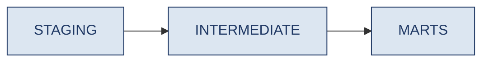
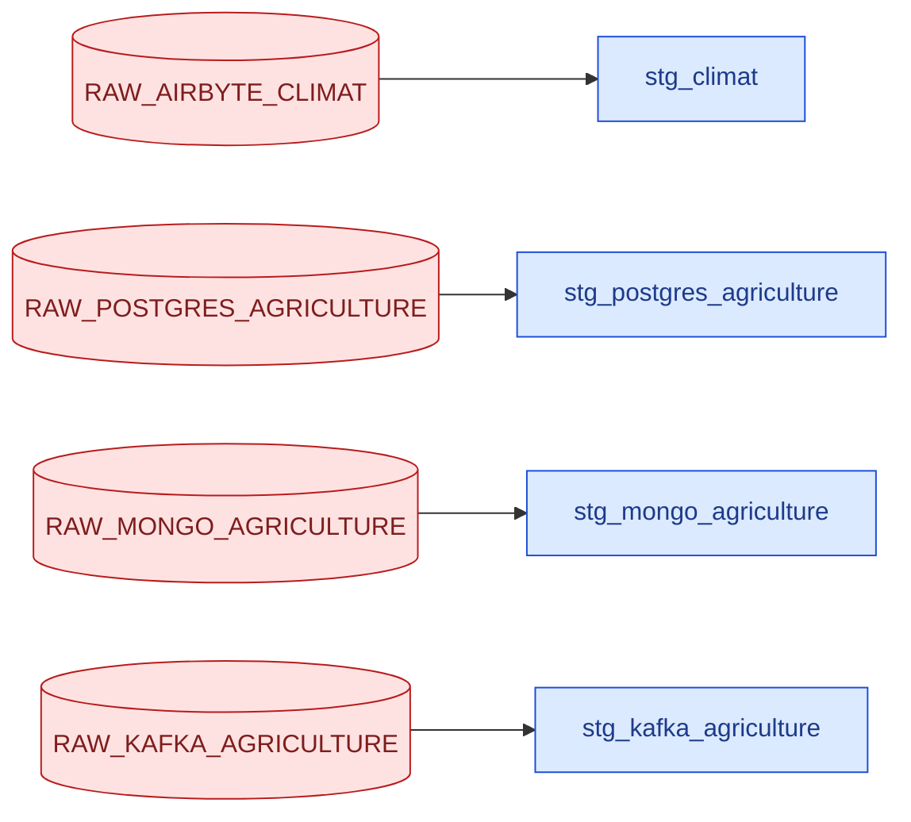
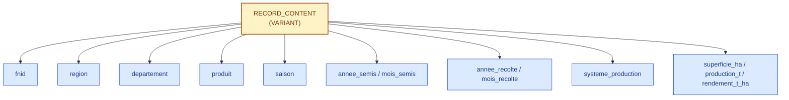
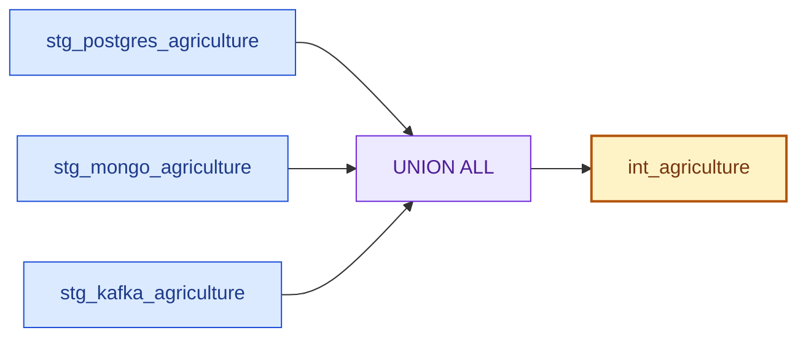
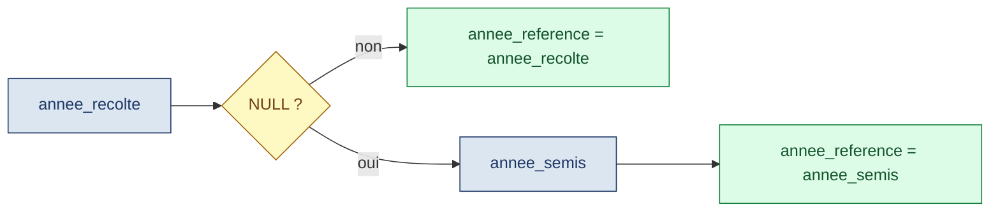
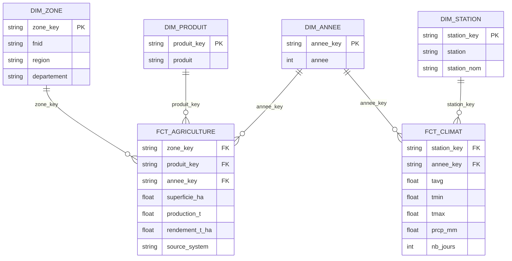
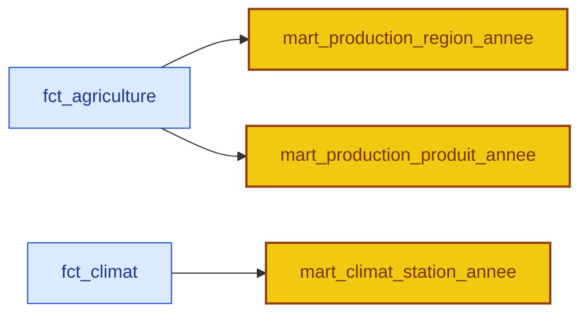
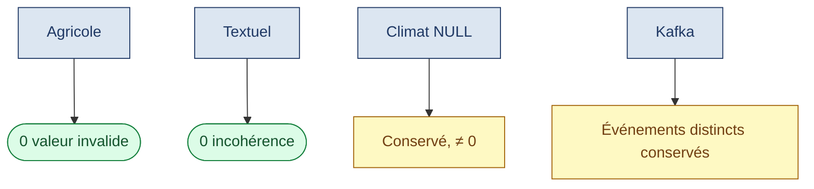
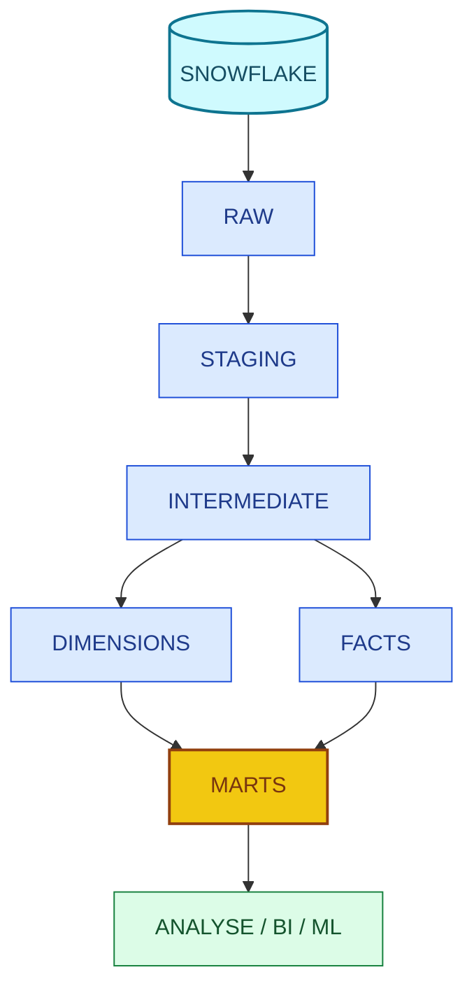

<div align="center">

# DataFlow360 — dbt, transformations et modélisation

### US17 — Préparation des données · Sprint 1

[](#)
[](#)
[](#)
[](#)

> Transformer les données présentes dans Snowflake avec **dbt**, de la zone RAW jusqu'aux modèles analytiques exploitables par la BI, l'API et le ML.

</div>

---

## Vue d'ensemble des 15 étapes

| # | Étape | Résultat |
|:---:|---|---|
| 1 | Objectif et chaîne de transformation | RAW → STAGING → INTERMEDIATE → DIMENSIONS/FAITS → MARTS |
| 2 | Installation de dbt | Environnement `dbt_venv/`, dbt 2.0.6 |
| 3 | Connexion à Snowflake | `dbt debug` → tous les checks passés |
| 4 | Structure dbt | `models/{staging,intermediate,marts}`, `macros/`, `tests/` |
| 5 | Staging | 4 modèles (`stg_climat`, `stg_postgres_agriculture`, `stg_mongo_agriculture`, `stg_kafka_agriculture`) |
| 6 | Cas particulier Kafka | Extraction des champs depuis `RECORD_CONTENT` (VARIANT) |
| 7 | Correction `stg_climat` | `TRY_CAST` remplacé par des casts adaptés aux types réels |
| 8 | Transformations intermédiaires | `int_agriculture` (UNION ALL des 3 sources) |
| 9 | Préparation pour la modélisation | Structure commune stabilisée |
| 10 | Dimensions | `dim_zone`, `dim_produit`, `dim_annee`, `dim_station` |
| 11 | Tables de faits | `fct_agriculture`, `fct_climat` |
| 12 | Modèles analytiques | 3 marts |
| 13 | Contrôle qualité | 4 familles de contrôles, aucune correction supplémentaire |
| 14 | Architecture finale | 14 modèles au total |
| 15 | Validation finale | `dbt build` → 14 modèles, 29 tests, 43 opérations, 0 erreur |

---

## Sommaire

- [1. Objectif](#1-objectif)
- [2. Installation de dbt](#2-installation-de-dbt)
- [3. Connexion à Snowflake](#3-connexion-à-snowflake)
- [4. Structure dbt](#4-structure-dbt)
- [5. Staging](#5-staging)
- [6. Cas particulier de Kafka](#6-cas-particulier-de-kafka)
- [7. Correction du modèle climat](#7-correction-du-modèle-climat)
- [8. Transformations intermédiaires](#8-transformations-intermédiaires)
- [9. Préparation pour la modélisation](#9-préparation-pour-la-modélisation)
- [10. Dimensions](#10-dimensions)
- [11. Tables de faits](#11-tables-de-faits)
- [12. Modèles analytiques](#12-modèles-analytiques)
- [13. Contrôle qualité](#13-contrôle-qualité)
- [14. Architecture finale](#14-architecture-finale)
- [15. Validation finale](#15-validation-finale)

---

## 1. Objectif


Le principe : chaque étape transforme et enrichit les données, sans jamais modifier directement la zone RAW.

---

## 2. Installation de dbt

```bash
# depuis la racine du projet
source dbt_venv/bin/activate

# depuis dbt_project/
source ../dbt_venv/bin/activate

dbt --version
# → dbt 2.0.6
```

---

## 3. Connexion à Snowflake

| Paramètre | Valeur |
|---|---|
| Account | `WHPMWEU-SY84726` |
| User | `ABDOUDJIGO243` |
| Database | `DATAFLOW360` |
| Warehouse | `DATAFLOW360_WH` |
| Role | `SYSADMIN` |

Configuration dans `~/.dbt/profiles.yml`. Le mot de passe n'est jamais versionné dans Git : il est chargé en variable d'environnement.

```bash
read -s -p "Mot de passe Snowflake: " SNOWFLAKE_PASSWORD
echo
export SNOWFLAKE_PASSWORD

dbt debug
# → Debugging connection test: OK
# → Debugged All checks passed!
```

---

## 4. Structure dbt

```text
dbt_project/
├── dbt_project.yml
├── macros/
├── models/
│   ├── staging/
│   ├── intermediate/
│   └── marts/
└── tests/
```



---

## 5. Staging

Quatre modèles constituent la première couche de préparation des données RAW.

| Modèle Staging | Table RAW source |
|---|---|
| `stg_climat` | `DATAFLOW360.RAW.RAW_AIRBYTE_CLIMAT` |
| `stg_postgres_agriculture` | `DATAFLOW360.RAW.RAW_POSTGRES_AGRICULTURE` |
| `stg_mongo_agriculture` | `DATAFLOW360.RAW.RAW_MONGO_AGRICULTURE` |
| `stg_kafka_agriculture` | `DATAFLOW360.RAW.RAW_KAFKA_AGRICULTURE` |



Transformations réalisées au Staging : suppression des colonnes techniques, standardisation des types, renommage des champs, extraction du JSON Kafka, préparation des données agricoles. L'harmonisation des formats, unités et valeurs entre les sources a été traitée séparément.

---

## 6. Cas particulier de Kafka

Les données Kafka arrivent principalement dans une colonne `VARIANT` nommée `RECORD_CONTENT`. Le modèle Staging extrait les champs du JSON plutôt que de conserver `RECORD_CONTENT` tel quel.



---

## 7. Correction du modèle climat

Après intégration d'une modification externe sur `stg_climat.sql`, des `TRY_CAST()` avaient été ajoutés aux colonnes climatiques — or ces colonnes RAW étaient déjà typées numériquement dans l'environnement Snowflake du projet.

```text
Function TRY_CAST cannot be used with arguments of types FLOAT
and NUMBER(38,0)
```

Correction appliquée : des casts adaptés aux types réels.

```sql
annee::INTEGER
mois::INTEGER
tavg::FLOAT
tmin::FLOAT
tmax::FLOAT
prcp_mm::FLOAT
nb_jours::INTEGER
```

Après correction, le pipeline complet a de nouveau été exécuté avec succès.

---

## 8. Transformations intermédiaires

`models/intermediate/int_agriculture.sql` regroupe les trois sources agricoles, qui partagent la même structure générale mais proviennent de systèmes différents.



Une colonne `source_system` conserve la provenance (`POSTGRES`, `MONGO`, `KAFKA`). Une colonne `annee_reference` donne une année commune aux analyses :



---

## 9. Préparation pour la modélisation

`int_agriculture` sert de base commune à la modélisation. Il contient : `fnid`, `region`, `departement`, `produit`, `saison`, `annee_semis`, `mois_semis`, `annee_recolte`, `mois_recolte`, `systeme_production`, `indicateur_qualite`, `superficie_ha`, `production_t`, `rendement_t_ha`, `source_system`, `annee_reference`.

Objectif : une structure suffisamment stable pour créer ensuite les dimensions et les tables de faits.

---

## 10. Dimensions

Quatre dimensions créées dans le schéma `MARTS`.

| Dimension | Contenu | Rôle |
|---|---|---|
| `dim_zone` | `fnid`, `region`, `departement` | Où se situe l'observation |
| `dim_produit` | Produits agricoles | Quel produit est concerné |
| `dim_annee` | Années (agricole + climat) | Analyses temporelles |
| `dim_station` | `station`, `station_nom` | Relier les observations climatiques aux stations |

---

## 11. Tables de faits

| Table de faits | Mesures | Clés vers les dimensions |
|---|---|---|
| `fct_agriculture` | `superficie_ha`, `production_t`, `rendement_t_ha` | `zone_key`, `produit_key`, `annee_key` (+ `source_system`) |
| `fct_climat` | `tavg`, `tmin`, `tmax`, `prcp_mm`, `nb_jours` | `station_key`, `annee_key` |



---

## 12. Modèles analytiques

| Mart | Granularité | Indicateurs | Usage type |
|---|---|---|---|
| `mart_production_region_annee` | Zone × année | `production_totale_t`, `superficie_totale_ha`, `rendement_moyen_t_ha`, `nombre_observations` | Évolution de la production selon zones et années |
| `mart_production_produit_annee` | Produit × année | `production`, `superficie`, `rendement` | Évolution par produit agricole |
| `mart_climat_station_annee` | Station × année | `temperature_moyenne`, `temperature_minimale`, `temperature_maximale`, `precipitation_totale_mm`, `nombre_jours` | Situation climatique d'une station sur une année |



Ces modèles sont destinés à être utilisés directement par les analyses et les futurs dashboards.

---

## 13. Contrôle qualité

| Contrôle | Champs / critères | Résultat |
|---|---|---|
| Données agricoles | `mois_semis`, `mois_recolte`, `superficie_ha`, `production_t`, `rendement_t_ha` | 0 mois invalide, 0 superficie négative, 0 production négative, 0 rendement négatif |
| Valeurs textuelles | `region`, `departement`, `produit`, `saison` | Aucune incohérence de casse ou d'espaces |
| Valeurs NULL climatiques | Colonnes climatiques | Conservées, jamais remplacées par `0` |
| Kafka | Clés apparaissant plusieurs fois | Valeurs et offsets distincts → aucune déduplication artificielle |



Aucune correction supplémentaire n'a été nécessaire sur ces critères.

---

## 14. Architecture finale



```text
STAGING
├── stg_climat
├── stg_postgres_agriculture
├── stg_mongo_agriculture
└── stg_kafka_agriculture

INTERMEDIATE
└── int_agriculture

DIMENSIONS
├── dim_zone
├── dim_produit
├── dim_annee
└── dim_station

FACTS
├── fct_agriculture
└── fct_climat

MARTS
├── mart_production_region_annee
├── mart_production_produit_annee
└── mart_climat_station_annee
```

---

## 15. Validation finale

```bash
dbt build
```

```text
14 modèles
29 tests
43 opérations
43 succès
0 erreur
```

Les couches Staging, Intermediate et Marts sont construites avec succès dans Snowflake.

### Conclusion

Après correction du problème `TRY_CAST` sur `stg_climat` et intégration des modifications du projet, le pipeline dbt complet (14 modèles, 4 couches) tourne de bout en bout sans erreur. La prochaine tâche indépendante — le test approfondi des modèles dbt — sera documentée séparément.

---

<div align="center">

*Assaman & Suuf — DataFlow360 — US17 — dbt, transformations et modélisation*

</div>