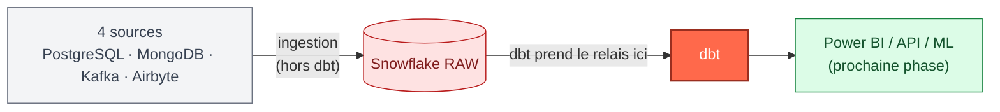
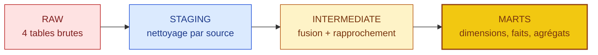
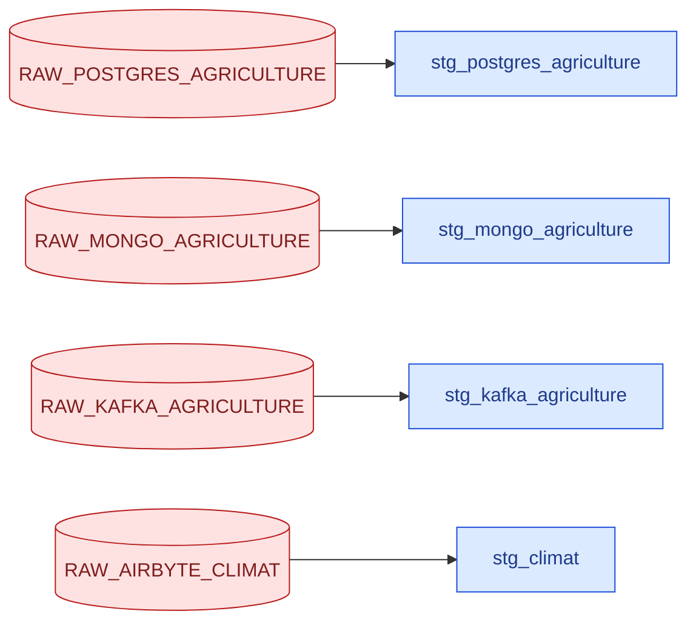
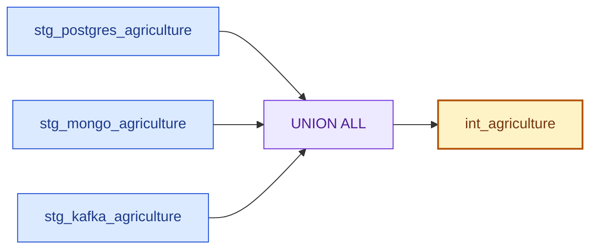
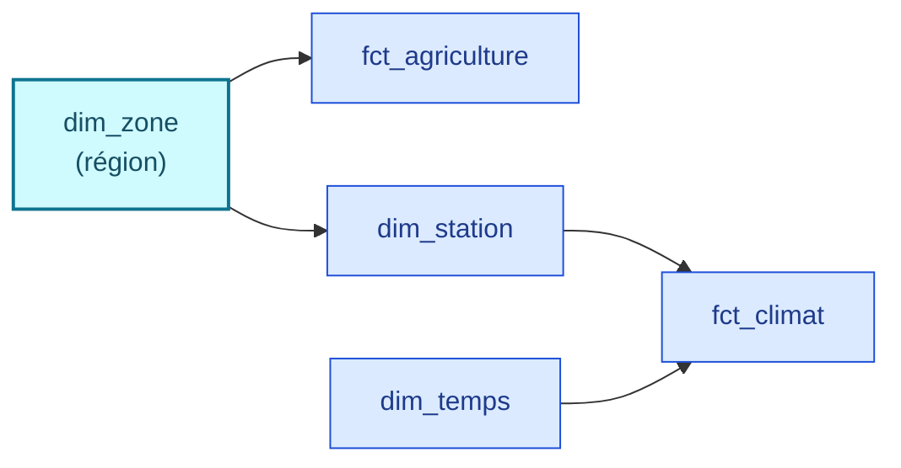
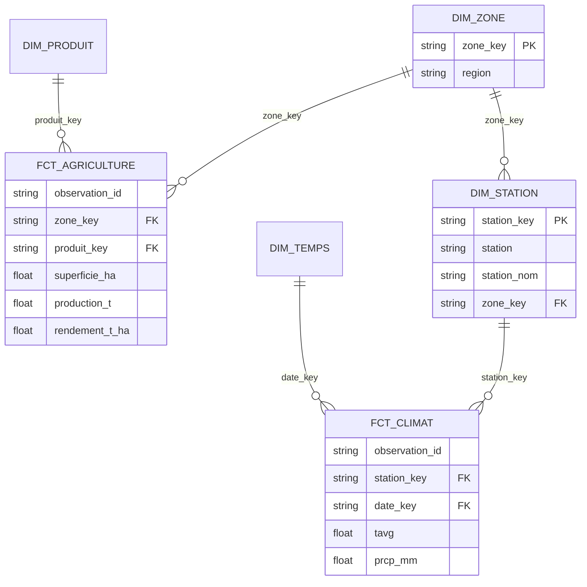
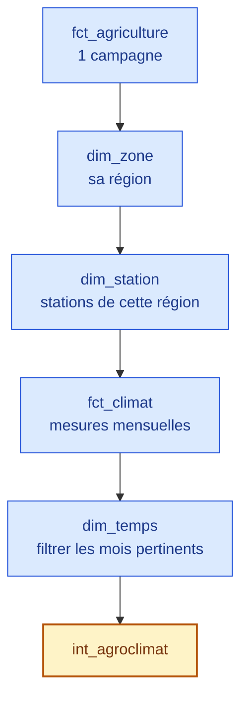
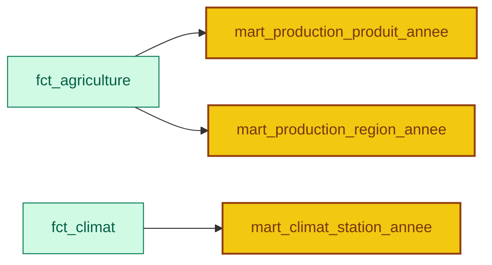
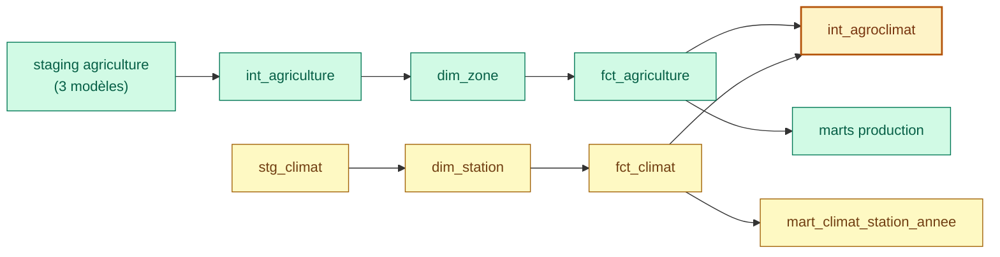

<div align="center">

# DataFlow360 — dbt : de la zone RAW aux modèles analytiques

### Documentation de l'architecture dbt actuelle — Assaman & Suuf

[](#)
[](#)
[](#)

> Ce document couvre la couche dbt (transformation des données) : ce qu'elle fait, pourquoi elle est construite ainsi, et comment l'exécuter. FastAPI, Redis et l'exposition API sont documentés séparément, dans leur propre phase du projet.

</div>

---

## Sommaire

- [1. Pourquoi dbt, et où il intervient](#1-pourquoi-dbt-et-où-il-intervient)
- [2. Architecture générale](#2-architecture-générale)
- [3. `source()` et `ref()`](#3-source-et-ref)
- [4. Staging — nettoyer source par source](#4-staging--nettoyer-source-par-source)
- [5. `int_agriculture` — fusionner les trois sources](#5-int_agriculture--fusionner-les-trois-sources)
- [6. `dim_zone` — la dimension qui relie tout](#6-dim_zone--la-dimension-qui-relie-tout)
- [7. Dimensions et faits, en détail](#7-dimensions-et-faits-en-détail)
- [8. `int_agroclimat` — rapprocher agriculture et climat](#8-int_agroclimat--rapprocher-agriculture-et-climat)
- [9. Marts analytiques](#9-marts-analytiques)
- [10. Tests](#10-tests)
- [11. Structure des fichiers](#11-structure-des-fichiers)
- [12. Commandes dbt](#12-commandes-dbt)
- [13. Graphe de dépendances](#13-graphe-de-dépendances)
- [14. Résumé pour un débutant](#14-résumé-pour-un-débutant)

---

## 1. Pourquoi dbt, et où il intervient

Les données arrivent dans Snowflake par quatre chemins d'ingestion distincts : PostgreSQL, MongoDB et Kafka pour l'agriculture, Airbyte pour le climat. Chacun a son propre outil, sa propre logique, son propre format de départ.

**dbt n'ingère rien.** Il prend le relais une fois que la donnée est déjà posée dans Snowflake, en zone RAW, et ne fait que la transformer — en SQL, par étapes successives, versionnées et testées. C'est un choix délibéré : si le nettoyage était écrit dans chaque script d'ingestion, il faudrait le corriger à quatre endroits différents à chaque changement de règle. En le centralisant dans dbt, une règle se corrige une fois, au bon endroit.



---

## 2. Architecture générale



| Couche | Rôle | Modèles |
|---|---|---|
| **RAW** (hors dbt) | Copie fidèle de ce que chaque source a réellement envoyé | `RAW_POSTGRES_AGRICULTURE`, `RAW_MONGO_AGRICULTURE`, `RAW_KAFKA_AGRICULTURE`, `RAW_AIRBYTE_CLIMAT` |
| **STAGING** | Isoler les particularités de chaque source avant de les faire se ressembler | `stg_postgres_agriculture`, `stg_mongo_agriculture`, `stg_kafka_agriculture`, `stg_climat` |
| **INTERMEDIATE** | Fusionner l'agricole, puis rapprocher agriculture et climat | `int_agriculture`, `int_agroclimat` |
| **MARTS — dimensions** | Informations descriptives, décrites une seule fois | `dim_zone`, `dim_produit`, `dim_station`, `dim_temps` |
| **MARTS — faits** | Les mesures elles-mêmes | `fct_agriculture`, `fct_climat` |
| **MARTS — analytiques** | Agrégats prêts à brancher sur un dashboard | `mart_production_produit_annee`, `mart_production_region_annee`, `mart_climat_station_annee` |

Soit **15 modèles** dbt, tous construits avec succès dans Snowflake lors de la dernière validation (`dbt build`).

---

## 3. `source()` et `ref()`

Deux fonctions dbt structurent toutes les dépendances du projet, et c'est ce qui permet à dbt de ne jamais se tromper dans l'ordre d'exécution :

| Fonction | Pointe vers | Exemple |
|---|---|---|
| `source('raw', 'raw_postgres_agriculture')` | Une table RAW créée par l'ingestion, en dehors de dbt | Toujours en entrée d'un modèle Staging |
| `ref('stg_postgres_agriculture')` | Un autre modèle dbt | Tout le reste de la chaîne |

```sql
-- plutôt que d'écrire en dur :
-- DATAFLOW360.RAW.RAW_POSTGRES_AGRICULTURE

-- on écrit :
SELECT * FROM {{ source('raw', 'raw_postgres_agriculture') }}
```

**Pourquoi cette distinction compte concrètement.** `source()` marque la frontière entre « ce que dbt ne contrôle pas » (l'ingestion) et « ce que dbt transforme ». `ref()` laisse dbt reconstruire lui-même, à partir de ces appels, l'ordre dans lequel les modèles doivent tourner (section 13) — personne n'a besoin de le déclarer à la main, et un modèle renommé ne casse rien ailleurs tant que les `ref()` sont à jour.

---

## 4. Staging — nettoyer source par source

Rôle commun aux quatre modèles : retirer les colonnes techniques inutiles à l'analyse, caster les types vers un référentiel commun, extraire le JSON quand nécessaire. **Rien de plus** — aucune jointure, aucune règle métier : ça, c'est le rôle des couches suivantes.

| Modèle | Ce qu'il nettoie | Pourquoi c'est spécifique |
|---|---|---|
| `stg_postgres_agriculture` | Colonnes techniques du chargement (`LOADED_AT`, `_DLT_ID`...) | Colonnes déjà typées nativement côté PostgreSQL : cast direct (`::INTEGER`, `::FLOAT`) |
| `stg_mongo_agriculture` | Colonnes aplaties du document Mongo | Arrivent en texte brut : `TRY_CAST` sur les champs numériques, pour qu'une valeur mal formée devienne `NULL` plutôt que de faire planter tout le modèle |
| `stg_kafka_agriculture` | Extraction du champ `VARIANT` `RECORD_CONTENT` | Les données métier ne sont pas dans des colonnes classiques mais dans un objet JSON : chaque champ est extrait explicitement (`RECORD_CONTENT:fnid::VARCHAR`, etc.) |
| `stg_climat` | Colonnes techniques Airbyte (`_AIRBYTE_*`) | Colonnes déjà numériques dans Snowflake : cast direct, pas de `TRY_CAST` |



Une règle d'harmonisation commune aux trois modèles agricoles mérite d'être mentionnée : la variable `systeme_production` arrive sous des formes différentes selon la source (`"Pluvial"`, `"pluvial"`, `"None"`...) et est ramenée, dans chacun des trois modèles, aux mêmes trois valeurs canoniques — `Pluvial`, `Irrigué`, `Décrue (PS)` — via une normalisation `LOWER(TRIM(...))` suivie d'un `CASE`.

---

## 5. `int_agriculture` — fusionner les trois sources

**Pourquoi une couche de fusion séparée.** Les trois sources agricoles partagent la même structure conceptuelle, mais restent trois flux distincts après le Staging. Sans `int_agriculture`, chaque dimension et chaque fait devrait relire les trois modèles Staging et refaire la fusion lui-même — avec le risque que la règle de fusion diverge d'un modèle à l'autre. En centralisant la fusion ici, elle ne se fait qu'une fois.

```sql
SELECT *, 'POSTGRES' AS source_system FROM {{ ref('stg_postgres_agriculture') }}
UNION ALL
SELECT *, 'MONGO'    AS source_system FROM {{ ref('stg_mongo_agriculture') }}
UNION ALL
SELECT *, 'KAFKA'    AS source_system FROM {{ ref('stg_kafka_agriculture') }}
```



**Pourquoi `UNION ALL` et pas `UNION`.** Le diagnostic préalable des sources a confirmé qu'aucune des trois sources ne se chevauche dans le temps et qu'aucune clé commune n'existe entre elles : il n'y a donc rien à dédupliquer, et `UNION ALL` évite le coût de calcul inutile d'une déduplication qui ne trouverait jamais rien.

Deux colonnes ajoutées ici :

| Colonne | Rôle |
|---|---|
| `source_system` | `POSTGRES` / `MONGO` / `KAFKA` — garde la trace de l'origine de chaque ligne même après fusion, utile pour isoler un problème propre à une seule source |
| `annee_reference` | `annee_recolte`, et seulement si elle est `NULL`, `annee_semis` — donne une année unique utilisable pour les analyses temporelles agricoles |

---

## 6. `dim_zone` — la dimension qui relie tout

C'est la pièce centrale de toute l'architecture, et elle mérite d'être comprise avant le reste.

**Le problème qu'elle résout.** L'agriculture et le climat ont besoin d'une géographie commune pour pouvoir un jour être croisés. Mais les stations météo ne sont connues qu'au niveau de la **région** — pas du département, pas du FNID. Si `dim_zone` descendait plus bas dans la hiérarchie géographique, elle romprait le seul niveau que les deux domaines partagent réellement, et `int_agroclimat` (section 8) deviendrait impossible à construire proprement.

`dim_zone` reste donc volontairement simple : `zone_key`, `region`. C'est le plus petit niveau géographique commun aux deux domaines, ni plus précis, ni plus large que nécessaire.



`dim_station.zone_key` rattache chaque station à sa région. Une région peut avoir plusieurs stations :

| Région | Station(s) |
|---|---|
| Dakar | Dakar-Ouakam, Dakar/Yoff |
| Kaolack | Kaolack |
| Saint-Louis | Podor, Saint-Louis |

**Trois régions (Fatick, Kaffrine, Sédhiou) n'ont actuellement aucune station** dans le périmètre de données disponible — c'est une limitation réelle de couverture, pas une erreur de modèle : il n'y a aucune station à inventer pour ces régions.

---

## 7. Dimensions et faits, en détail

| Modèle | Contenu | Grain / rôle |
|---|---|---|
| `dim_zone` | `zone_key`, `region` | Référence géographique commune agriculture/climat |
| `dim_produit` | `produit_key`, `produit` | Les produits agricoles |
| `dim_station` | `station_key`, `station`, `station_nom`, `zone_key` | Les stations météo, rattachées à leur région |
| `dim_temps` | `date_key` (`annee*100+mois`), `annee`, `mois`, `nom_mois`, `trimestre` | **Pas un calendrier généré** : construite uniquement à partir des couples année/mois réellement observés dans le climat |
| `fct_agriculture` | `observation_id`, `zone_key`, `produit_key`, `fnid`, `saison`, dates de semis/récolte, `systeme_production`, `superficie_ha`, `production_t`, `rendement_t_ha`, `source_system` | **Grain : 1 campagne agricole.** Les mois de semis et de récolte sont des *attributs* de la campagne, pas une preuve que l'agriculture est une donnée mensuelle |
| `fct_climat` | `observation_id`, `station_key`, `date_key`, `tavg`, `tmin`, `tmax`, `prcp_mm`, `nb_jours` | **Grain : 1 station × 1 année × 1 mois** |

**Point d'attention sur `observation_id` :** cette clé technique identifie une ligne, mais n'est pas garantie unique au sens métier — des doublons existent dans certaines sources (voir le diagnostic initial sur les événements multiples Kafka). Elle ne doit pas être utilisée comme clé de dédoublonnage.



---

## 8. `int_agroclimat` — rapprocher agriculture et climat

C'est le modèle qui répond à la vraie question métier du projet : **quel climat une campagne agricole a-t-elle connu ?**



**Règle de rapprochement :** année climatique = année de récolte (c'est l'année où le rendement, résultat de la campagne, est connu) ; mois climatique compris entre `mois_semis` et `mois_recolte`. Simplification actuelle : aucune campagne du jeu de données ne traverse deux années civiles, le modèle n'a donc pas besoin de gérer ce cas pour l'instant.

**Grain : 1 campagne × 1 station de sa région × 1 mois climatique disponible pendant la campagne.** Une campagne de 6 mois peut donc produire plusieurs lignes selon le nombre de stations de sa région :

| Région | Stations | Mois de campagne | Lignes possibles |
|---|:---:|:---:|:---:|
| Kaolack | 1 | 6 | jusqu'à 6 |
| Dakar | 2 | 6 | jusqu'à 12 |

Aucune contrainte d'unicité n'est posée sur `agriculture_observation_id` dans ce modèle : une même campagne apparaît légitimement plusieurs fois, une fois par mois × par station — ce n'est pas un doublon à corriger.

**Exemple réel documenté :** Arachide (en coque), région de Kaolack, campagne 2000, semis en juin, récolte en novembre, station de Kaolack.

| Mois | TAVG | PRCP (mm) |
|---|--:|--:|
| Juin | 29,41 | 11,7 |
| Juillet | 28,17 | 33,8 |
| Août | 27,37 | 209,5 |
| Septembre | 28,35 | 237,2 |
| Octobre | 28,31 | 88,0 |
| Novembre | 28,20 | `NULL` |

`NULL ≠ 0` : l'absence de mesure en novembre signifie que la donnée n'est pas disponible, pas qu'il n'a pas plu.

**Couverture actuelle : 59,24 %** des campagnes agricoles (5 912 sur 9 979) ont un climat associé. Les campagnes restantes n'ont pas de station dans leur région, ou pas de mois climatique disponible pendant leur période — ce ne sont pas des erreurs : le modèle choisit volontairement de ne conserver que les correspondances réellement disponibles, plutôt que d'inventer une valeur climatique approximative.

---

## 9. Marts analytiques

| Mart | Granularité | Indicateurs |
|---|---|---|
| `mart_production_produit_annee` | Produit × année de récolte | `production_totale_t`, `superficie_totale_ha`, `rendement_moyen_t_ha`, `nombre_observations` |
| `mart_production_region_annee` | Région × année de récolte | Mêmes agrégats, par région, via `fct_agriculture.zone_key → dim_zone` |
| `mart_climat_station_annee` | Station × année | `temperature_moyenne`/`minimale`/`maximale`, `precipitation_totale_mm`, `nombre_jours`, `nombre_observations` |



---

## 10. Tests

Le projet compte 114 tests de données. Ils couvrent :

| Type | Vérifie |
|---|---|
| `not_null` | Qu'un champ obligatoire n'est jamais vide |
| `unique` | Qu'il n'existe pas deux fois la même clé de dimension (`zone_key`, `produit_key`, `station_key`, `date_key`) |
| `relationships` | Qu'aucune ligne de fait ne pointe vers une dimension inexistante (`fct_agriculture.zone_key → dim_zone`, `fct_agriculture.produit_key → dim_produit`, `dim_station.zone_key → dim_zone`, `fct_climat.station_key → dim_station`, `fct_climat.date_key → dim_temps`) |
| `accepted_values` | `source_system` limité à `POSTGRES`/`MONGO`/`KAFKA` ; `systeme_production` limité à `Pluvial`/`Irrigué`/`Décrue (PS)` |

| `valeur_dans_intervalle` | Test générique maison (`tests/generic/`) : une colonne reste dans `[min, max]` — mois entre 1 et 12, mesures agricoles et précipitations ≥ 0, `nb_jours` ≤ 31, `trimestre` entre 1 et 4, au plus 12 relevés par station et par an |
| `combinaison_unique` | Test générique maison : vérifie le grain d'un modèle — `fct_climat` (station × mois), `int_agroclimat` (campagne × station × mois), et chaque mart (produit × année, région × année, station × année) |

Tests SQL personnalisés :

| Test | Sévérité | Vérifie |
|---|---|---|
| `assert_agriculture_positive_values`, `assert_mesures_agricoles_non_negatives` | error | Superficie, production et rendement jamais négatifs |
| `assert_agriculture_valid_months`, `assert_mois_valides`, `assert_climat_valid_months` | error | Mois compris entre 1 et 12 |
| `assert_int_agriculture_complet` | error | L'union de `int_agriculture` ne perd ni ne duplique aucune ligne du staging, source par source |
| `assert_mart_production_produit_reconcilie`, `assert_mart_production_region_reconcilie` | error | Les marts reprennent exactement le nombre d'observations et la production de `fct_agriculture` |
| `assert_agroclimat_mois_dans_campagne` | error | Chaque mois climatique de `int_agroclimat` tombe l'année de récolte, entre semis et récolte |
| `assert_agriculture_campagne_coherente` | warn | La récolte ne précède pas le semis |
| `assert_agriculture_campagne_meme_annee` | warn | Aucune campagne ne traverse deux années civiles — hypothèse sur laquelle repose `int_agroclimat` (section 8) |
| `assert_agriculture_rendement_coherent` | warn | `rendement_t_ha` ≈ `production_t / superficie_ha`, à 10 % près |
| `assert_climat_temperatures_coherentes` | warn | `tmin ≤ tavg ≤ tmax` |

**Choix de sévérité.** Avec `dbt build`, un test en `error` qui échoue bloque tous les modèles en aval. Les clés, le grain, la complétude et les règles structurelles sont donc en `error` ; les contrôles de plausibilité des mesures (qui dépendent de la qualité des données sources, pas du code dbt) sont en `warn` : ils signalent sans bloquer.

`assert_climat_valid_months` contrôle les mois dans `dim_temps`, pas directement dans `fct_climat`, puisque `fct_climat` pointe vers `dim_temps` via `date_key` : la validité du mois se vérifie à la source de cette information, pas à chaque ligne de fait qui s'y réfère.

---

## 11. Structure des fichiers

```text
dbt_project/
├── dbt_project.yml
├── macros/
├── tests/                      # tests SQL personnalisés
│   ├── generic/                # tests génériques réutilisables dans les schema.yml
│   │   ├── combinaison_unique.sql
│   │   └── valeur_dans_intervalle.sql
│   └── assert_*.sql            # 13 tests singuliers
└── models/
    ├── staging/
    │   ├── schema.yml
    │   ├── sources.yml
    │   └── stg_*.sql              # 4 modèles
    ├── intermediate/
    │   ├── schema.yml
    │   ├── int_agriculture.sql
    │   └── int_agroclimat.sql
    └── marts/
        ├── schema.yml
        ├── dim_*.sql               # 4 dimensions
        ├── fct_*.sql               # 2 faits
        └── mart_*.sql              # 3 marts
```

**Pourquoi un `schema.yml` par couche plutôt qu'un fichier central.** Garder la documentation et les tests au plus près des modèles qu'ils décrivent évite de chercher dans un fichier unique et volumineux à chaque modification : un modèle Staging se documente dans `staging/schema.yml`, pas dans un fichier global partagé par les 15 modèles du projet.

---

## 12. Commandes dbt

| Commande | Usage |
|---|---|
| `dbt parse` | Vérifier que le projet est correctement interprétable |
| `dbt compile` | Compiler le SQL des modèles sans les construire dans Snowflake |
| `dbt run` | Construire les modèles dans Snowflake |
| `dbt test` | Exécuter les tests |
| `dbt build` | Construire les modèles et exécuter les tests, dans l'ordre des dépendances |

```bash
dbt build
```

---

## 13. Graphe de dépendances

dbt déduit automatiquement l'ordre d'exécution à partir des `ref()` et `source()` de chaque modèle — personne n'a besoin de le déclarer à la main.



---

## 14. Résumé pour un débutant

```text
RAW          → données brutes, jamais modifiées par dbt
STAGING      → nettoyage et typage, une source à la fois
INTERMEDIATE → fusion de l'agricole, puis rapprochement avec le climat
MARTS        → dimensions, faits et agrégats prêts pour l'analyse
TESTS        → vérification automatique que rien ne casse silencieusement
```

`dim_zone` (la région) est la seule dimension partagée entre agriculture et climat, parce que les stations météo ne sont connues qu'à ce niveau. `int_agroclimat` est le modèle qui exploite ce pont : il rapproche chaque campagne agricole des conditions climatiques réellement disponibles pendant sa durée, avec une couverture honnête de 59 % plutôt qu'une donnée inventée pour combler les trous.

---

<div align="center">

*Assaman & Suuf — DataFlow360 — dbt : architecture actuelle*

</div>