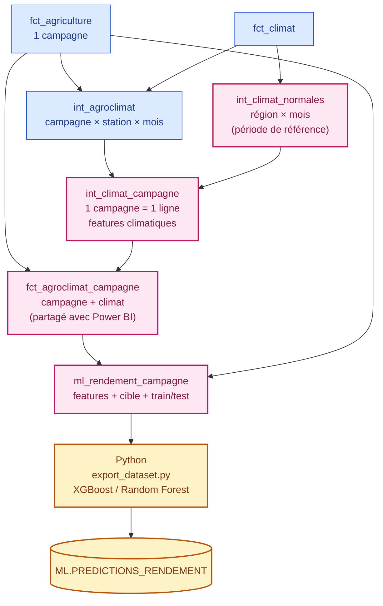

# DataFlow360 — Modélisation dbt pour le Machine Learning

### Préparer le jeu d'entraînement du modèle de prédiction des rendements (US07)

> **Statut : proposition de conception — pas encore implémentée.**
> Ce document décrit les modèles dbt à ajouter pour produire une table prête pour XGBoost / Random Forest. Il s'appuie sur les modèles existants décrits dans [README_dbt_staging.md](README_dbt_staging.md).

---

## Sommaire

- [1. La question posée au modèle](#1-la-question-posée-au-modèle)
- [2. Vue d'ensemble](#2-vue-densemble)
- [3. Grain et clé](#3-grain-et-clé)
- [4. Les features](#4-les-features)
- [5. Éviter les fuites de données](#5-éviter-les-fuites-de-données)
- [6. Les modèles dbt à créer](#6-les-modèles-dbt-à-créer)
- [7. Configuration et tests](#7-configuration-et-tests)
- [8. Ce qui reste côté Python](#8-ce-qui-reste-côté-python)
- [9. Points à vérifier avant d'entraîner](#9-points-à-vérifier-avant-dentraîner)

---

## 1. La question posée au modèle

**Pour une campagne agricole donnée — une culture, dans une zone, une saison et une année — quel rendement (t/ha) peut-on attendre, compte tenu du climat observé pendant la campagne ?**

| Élément | Choix |
|---|---|
| Type de problème | Régression supervisée |
| Cible | `rendement_t_ha` de `fct_agriculture` |
| Unité de prédiction | Une campagne agricole (`observation_id`) |
| Modèles prévus | XGBoost, Random Forest |
| Moment de la prédiction | Fin de campagne, une fois le climat de la période semis → récolte connu |

Le rendement est la bonne cible plutôt que la production : la production dépend surtout de la surface cultivée, alors que le rendement isole l'effet du climat et des pratiques sur une surface donnée.

---

## 2. Vue d'ensemble



**Principe :** dbt fait tout ce qui est déterministe et commun à tous les modèles (jointures, agrégations climatiques, historique, découpage train/test). Il garde toutes les campagnes et laisse le climat manquant à `NULL`. Python ne fait que ce qui dépend de l'apprentissage (encodage, imputation du climat manquant, entraînement), pour que chaque expérience parte exactement du même jeu de données.

`fct_agroclimat_campagne` est volontairement placé dans les marts : c'est aussi la table « Campagnes » du modèle Power BI (voir [README_modelisation_powerbi.md](README_modelisation_powerbi.md)). Le ML et le dashboard montrent ainsi les mêmes chiffres.

---

## 3. Grain et clé

**Une ligne = une campagne agricole, avec ou sans climat disponible.**

Toutes les campagnes ayant un rendement sont gardées : les ~59 % qui ont un climat et les ~41 % qui n'en ont pas. Pour ces dernières, les features climatiques sont `NULL` dans dbt et seront **imputées en Python** (voir [§ 8](#8-ce-qui-reste-côté-python)). La colonne `a_climat` permet de distinguer une valeur mesurée d'une valeur imputée.

`int_agroclimat` est au grain campagne × station × mois : une campagne de 6 mois dans une région à 2 stations y occupe 12 lignes. Un modèle de régression a besoin d'**une ligne par observation à prédire** ; il faut donc remonter au grain de la campagne en agrégeant le climat :

1. **Mois par mois, moyenne des stations de la région** — une région à deux stations ne doit pas compter sa pluie deux fois.
2. **Sur l'ensemble de la campagne, agrégation des mois** — cumul, moyenne, extrêmes.

Clé : `observation_id` (déjà unique dans `fct_agriculture`, testé).

---

## 4. Les features

### Caractéristiques de la campagne

| Feature | Calcul | Pourquoi |
|---|---|---|
| `produit` | `dim_produit` | Chaque culture a son propre niveau de rendement |
| `region` | `dim_zone` | Sols, pratiques et climat moyen propres à la région |
| `saison` | `fct_agriculture` | Saison principale vs contre-saison |
| `systeme_production` | `fct_agriculture` | Pluvial / Irrigué / Décrue : l'irrigation réduit la dépendance à la pluie |
| `mois_semis`, `mois_recolte` | `fct_agriculture` | Calendrier cultural |
| `duree_campagne_mois` | `mois_recolte - mois_semis + 1` | Cycles courts vs longs |
| `superficie_ha` | `fct_agriculture` | **À valider**, voir [§ 5](#5-éviter-les-fuites-de-données) |

### Climat pendant la campagne

| Feature | Calcul | Pourquoi |
|---|---|---|
| `pluie_cumul_mm` | Somme des pluies mensuelles | Premier facteur du rendement en culture pluviale |
| `pluie_mois_max_mm` | Mois le plus pluvieux | Repère les excès d'eau |
| `nb_mois_secs` | Mois avec moins de 10 mm | Repère les poches de sécheresse en cours de campagne |
| `tavg_moyenne` | Moyenne des températures moyennes | Stress thermique global |
| `tmax_max`, `tmin_min` | Extrêmes de la campagne | Pics de chaleur, nuits froides |
| `pluie_anomalie_mm` | Pluie observée − normale de la région, sur les mêmes mois | Une année « sèche » à Ziguinchor n'est pas une année sèche à Matam : l'anomalie rend les régions comparables |
| `tavg_anomalie` | Écart moyen à la température normale | Idem pour la température |
| `nb_mois_climat` | Mois climatiques disponibles | Qualité de la mesure |
| `taux_couverture_climat` | `nb_mois_climat / duree_campagne_mois` | Le modèle peut apprendre à moins se fier à un climat incomplet |
| `a_climat` | Au moins un mois climatique rattaché à la campagne | Indicateur de valeur manquante : après imputation, le modèle sait encore quelles campagnes ont un climat mesuré et lesquelles ont un climat estimé |

`NULL ≠ 0` reste valable : un mois sans mesure de pluie ne compte ni dans `pluie_cumul_mm`, ni dans `nb_mois_secs`. Le cumul peut donc être sous-estimé quand la couverture est incomplète — c'est précisément pourquoi `taux_couverture_climat` est fourni à côté.

**Campagnes sans climat (~41 %) :** toutes les features climatiques ci-dessus sont `NULL`, et `nb_mois_climat` aussi. dbt ne les remplace pas par 0 ni par une moyenne : l'imputation dépend du jeu d'entraînement et se fait en Python. Ces campagnes n'ont pas de climat pour deux raisons principales, à garder en tête pour choisir la méthode d'imputation :

- **Région sans station** (Fatick, Kaffrine, Sédhiou) : le climat manque pour toutes les années. Ces régions n'ont pas non plus de normales, donc pas d'anomalies.
- **Année ou mois hors de la période couverte par les relevés**, ou campagne à cheval sur deux années (ignorée par `int_agroclimat`).

### Historique

| Feature | Calcul | Pourquoi |
|---|---|---|
| `rendement_n_1` | Rendement de la même unité (`fnid`, produit, saison, système) l'année précédente | Capte le niveau « habituel » de la zone ; c'est souvent la feature la plus prédictive |

L'historique est pris sur l'année `annee - 1` exactement (auto-jointure), pas avec `LAG()` : `LAG()` renverrait la dernière année *disponible*, qui peut être 5 ans plus tôt s'il manque des années.

---

## 5. Éviter les fuites de données

Une fuite, c'est une feature qui contient — directement ou non — la réponse. Le modèle paraît excellent en test et s'effondre en production.

| Risque | Décision |
|---|---|
| `production_t` | **Exclue.** `rendement = production / superficie` : la donner au modèle revient à lui donner la réponse. |
| `superficie_ha` | **À valider.** Si c'est la surface *semée*, elle est connue avant la récolte → feature valide. Si c'est la surface *récoltée*, elle n'est connue qu'après → à exclure. Elle est conservée dans la table pour décider en Python. |
| Normales climatiques | Calculées **uniquement sur les années d'entraînement** (`annee <= ml_annee_fin_train`). Sinon, le climat des années de test influencerait les features d'entraînement. |
| Découpage train / test | **Temporel**, pas aléatoire. Un découpage aléatoire mettrait en entraînement des campagnes de la même année et de la même région que le test, qui partagent exactement le même climat. |
| `rendement_n_1` | Valide : il n'utilise que le passé. |
| Imputation du climat manquant | **Apprise sur `train` uniquement**, puis appliquée à `test`. Une moyenne ou un modèle d'imputation calculé sur toutes les années ferait entrer le climat des années de test dans l'entraînement. |

La même variable dbt `ml_annee_fin_train` fixe à la fois la fin de la période de référence des normales et la frontière train / test : les deux restent cohérentes par construction.

---

## 6. Les modèles dbt à créer

### `int_climat_normales` — le climat « habituel »

```sql
-- models/intermediate/int_climat_normales.sql
-- Normales climatiques : une ligne par région et par mois.
-- Calculées sur les seules années d'entraînement, pour que le climat
-- des années de test ne fuite pas dans les features.

SELECT
    s.zone_key,
    t.mois,

    AVG(c.prcp_mm) AS prcp_mm_normale,
    AVG(c.tavg)    AS tavg_normale,

    COUNT(DISTINCT t.annee) AS nb_annees_reference

FROM {{ ref('fct_climat') }} AS c

INNER JOIN {{ ref('dim_station') }} AS s
    ON c.station_key = s.station_key

INNER JOIN {{ ref('dim_temps') }} AS t
    ON c.date_key = t.date_key

WHERE t.annee <= {{ var('ml_annee_fin_train') }}

GROUP BY
    s.zone_key,
    t.mois
```

### `int_climat_campagne` — le climat résumé par campagne

```sql
-- models/intermediate/int_climat_campagne.sql
-- Climat d'une campagne : une ligne par campagne agricole
-- ayant au moins un mois climatique disponible.
-- Les stations d'une même région sont d'abord moyennées mois par mois,
-- pour qu'une région à deux stations ne compte pas sa pluie deux fois.

WITH climat_mensuel AS (

    SELECT
        agriculture_observation_id,
        zone_key,
        mois_climatique,

        AVG(tavg)    AS tavg,
        MIN(tmin)    AS tmin,
        MAX(tmax)    AS tmax,
        AVG(prcp_mm) AS prcp_mm

    FROM {{ ref('int_agroclimat') }}

    GROUP BY
        agriculture_observation_id,
        zone_key,
        mois_climatique
),

avec_normales AS (

    SELECT
        c.*,
        n.prcp_mm_normale,
        n.tavg_normale

    FROM climat_mensuel AS c

    LEFT JOIN {{ ref('int_climat_normales') }} AS n
        ON c.zone_key = n.zone_key
       AND c.mois_climatique = n.mois
)

SELECT
    agriculture_observation_id,

    COUNT(*)                 AS nb_mois_climat,
    COUNT(prcp_mm)           AS nb_mois_pluie_mesuree,

    SUM(prcp_mm)             AS pluie_cumul_mm,
    MAX(prcp_mm)             AS pluie_mois_max_mm,
    COUNT_IF(prcp_mm < 10)   AS nb_mois_secs,

    AVG(tavg)                AS tavg_moyenne,
    MAX(tmax)                AS tmax_max,
    MIN(tmin)                AS tmin_min,

    -- Anomalies : seuls les mois mesurés sont comparés à leur normale.
    SUM(prcp_mm - prcp_mm_normale) AS pluie_anomalie_mm,
    AVG(tavg - tavg_normale)       AS tavg_anomalie

FROM avec_normales

GROUP BY agriculture_observation_id
```

### `fct_agroclimat_campagne` — la campagne enrichie de son climat (marts)

Table partagée avec Power BI. Elle garde **toutes** les campagnes (`LEFT JOIN`) et signale celles qui ont un climat avec `a_climat` : le dashboard comme le ML utilisent les 9 979 campagnes ; le ML impute ensuite le climat de celles qui n'en ont pas.

```sql
-- models/marts/fct_agroclimat_campagne.sql
-- Fait agroclimatique : une ligne par campagne agricole,
-- avec le résumé du climat observé entre semis et récolte.

SELECT
    f.observation_id,

    f.zone_key,
    f.produit_key,
    f.annee_recolte AS annee,

    f.fnid,
    f.saison,
    f.systeme_production,
    f.indicateur_qualite,
    f.source_system,

    f.mois_semis,
    f.mois_recolte,
    f.mois_recolte - f.mois_semis + 1 AS duree_campagne_mois,

    f.superficie_ha,
    f.production_t,
    f.rendement_t_ha,

    c.agriculture_observation_id IS NOT NULL AS a_climat,

    c.nb_mois_climat,
    c.nb_mois_climat / NULLIF(f.mois_recolte - f.mois_semis + 1, 0) AS taux_couverture_climat,

    c.pluie_cumul_mm,
    c.pluie_mois_max_mm,
    c.nb_mois_secs,
    c.pluie_anomalie_mm,

    c.tavg_moyenne,
    c.tmax_max,
    c.tmin_min,
    c.tavg_anomalie

FROM {{ ref('fct_agriculture') }} AS f

LEFT JOIN {{ ref('int_climat_campagne') }} AS c
    ON f.observation_id = c.agriculture_observation_id
```

### `ml_rendement_campagne` — le jeu d'entraînement

Dossier `models/ml/`, schéma Snowflake `ML`. Les colonnes sont regroupées par rôle : identifiants (jamais donnés au modèle), features, cible, découpage.

```sql
-- models/ml/ml_rendement_campagne.sql
-- Jeu d'entraînement : une ligne par campagne ayant un rendement,
-- avec ou sans climat. Le climat manquant (a_climat = FALSE) reste NULL
-- et sera imputé en Python.
-- production_t est volontairement absente (fuite : rendement = production / superficie).

WITH historique AS (

    -- Rendement d'une unité (zone, produit, saison, système) pour une année donnée.
    SELECT
        fnid,
        produit_key,
        saison,
        systeme_production,
        annee_recolte,
        AVG(rendement_t_ha) AS rendement_t_ha

    FROM {{ ref('fct_agriculture') }}

    WHERE rendement_t_ha > 0

    GROUP BY
        fnid,
        produit_key,
        saison,
        systeme_production,
        annee_recolte
)

SELECT
    -- Identifiants : pour tracer les prédictions, pas pour apprendre.
    a.observation_id,
    a.fnid,
    a.annee,

    -- Features : campagne.
    p.produit,
    z.region,
    a.saison,
    a.systeme_production,
    a.mois_semis,
    a.mois_recolte,
    a.duree_campagne_mois,
    a.superficie_ha,

    -- Features : climat (NULL si a_climat = FALSE, imputées en Python).
    a.a_climat,
    a.pluie_cumul_mm,
    a.pluie_mois_max_mm,
    a.nb_mois_secs,
    a.pluie_anomalie_mm,
    a.tavg_moyenne,
    a.tmax_max,
    a.tmin_min,
    a.tavg_anomalie,
    a.nb_mois_climat,
    a.taux_couverture_climat,

    -- Features : historique.
    h.rendement_t_ha AS rendement_n_1,

    -- Cible.
    a.rendement_t_ha AS cible_rendement_t_ha,

    -- Découpage temporel, aligné sur la période des normales.
    IFF(a.annee <= {{ var('ml_annee_fin_train') }}, 'train', 'test') AS jeu

FROM {{ ref('fct_agroclimat_campagne') }} AS a

INNER JOIN {{ ref('dim_zone') }} AS z
    ON a.zone_key = z.zone_key

INNER JOIN {{ ref('dim_produit') }} AS p
    ON a.produit_key = p.produit_key

LEFT JOIN historique AS h
    ON  h.fnid = a.fnid
    AND h.produit_key = a.produit_key
    AND EQUAL_NULL(h.saison, a.saison)
    AND EQUAL_NULL(h.systeme_production, a.systeme_production)
    AND h.annee_recolte = a.annee - 1

WHERE a.rendement_t_ha > 0
```

`EQUAL_NULL` (Snowflake) traite deux `NULL` comme égaux : une campagne sans saison renseignée retrouve quand même son historique sans saison.

---

## 7. Configuration et tests

### `dbt_project.yml`

```yaml
models:
  dataflow360:
    # ... staging, intermediate, marts inchangés ...

    ml:
      +schema: ML
      +materialized: table

vars:
  # Dernière année d'entraînement : les années suivantes forment le test,
  # et les normales climatiques ne sont calculées que jusqu'à cette année.
  # À fixer selon la plage réelle des données (garder ~20 % des années en test).
  ml_annee_fin_train: 2007
```

### `models/ml/schema.yml`

```yaml
version: 2

models:
  # Une ligne représente une campagne agricole avec rendement connu,
  # avec ou sans climat (a_climat).
  - name: ml_rendement_campagne
    columns:
      - name: observation_id
        tests:
          - not_null
          - unique

      - name: a_climat
        tests:
          - not_null

      - name: cible_rendement_t_ha
        tests:
          - not_null
          - valeur_dans_intervalle:
              arguments:
                min_value: 0

      - name: jeu
        tests:
          - not_null
          - accepted_values:
              arguments:
                values: ['train', 'test']

      - name: taux_couverture_climat
        tests:
          - valeur_dans_intervalle:
              arguments:
                min_value: 0
                max_value: 1
```

À ajouter également :

- `int_climat_campagne` : `agriculture_observation_id` `not_null` + `unique`.
- `int_climat_normales` : `combinaison_unique` sur `['zone_key', 'mois']`.
- `fct_agroclimat_campagne` : `observation_id` `unique`, et un test singulier vérifiant qu'elle a **exactement** le même nombre de lignes que `fct_agriculture` (le `LEFT JOIN` ne doit ni perdre ni dupliquer de campagne).
- Un test singulier en `warn` qui vérifie que les deux jeux sont non vides — si `ml_annee_fin_train` est mal réglée, tout part en `train` sans erreur visible.
- Un test singulier en `warn` qui vérifie que chaque jeu contient des campagnes avec **et** sans climat — si `test` n'avait que des campagnes sans climat (ou l'inverse), les métriques ne mesureraient qu'un seul des deux cas.

---

## 8. Ce qui reste côté Python

Ces étapes **ne doivent pas** être faites dans dbt, car elles s'apprennent sur le jeu d'entraînement :

| Étape | Raison |
|---|---|
| Encodage de `produit`, `region`, `saison`, `systeme_production` | One-hot pour Random Forest ; XGBoost accepte aussi les catégories natives |
| Imputation du climat manquant (~41 % des campagnes) | Apprise sur `train` uniquement, puis appliquée à `test`. Voir ci-dessous. |
| Validation croisée | `TimeSeriesSplit` sur les années du jeu `train`, pas de `KFold` aléatoire |
| Référence (baseline) | Comparer chaque modèle à `rendement_n_1`, puis à la moyenne région × produit. Un modèle qui ne bat pas ces références n'apporte rien. |
| Métriques | MAE (lisible en t/ha), RMSE, R² — sur `test` seulement |

### Imputation du climat

Les features climatiques des campagnes sans climat (`a_climat = FALSE`) sont imputées avant l'entraînement. Méthodes possibles, de la plus simple à la plus fine :

| Méthode | Principe | Limite |
|---|---|---|
| Médiane par groupe | Médiane de `train` par mois de semis / récolte, produit et année si disponible | Ignore la géographie |
| Région voisine | Climat de la même année dans la région la plus proche ayant une station (ex. Kaffrine ← Kaolack, Fatick ← Kaolack, Sédhiou ← Kolda) | Correspondance à définir et à justifier |
| KNN / imputation itérative | `KNNImputer` ou `IterativeImputer` (scikit-learn) sur les autres features | Plus coûteux, à valider en validation croisée |

Dans tous les cas :

- **Garder `a_climat` comme feature** : le modèle apprend que le climat imputé est moins fiable que le climat mesuré.
- **Ajuster l'imputeur dans le pipeline** (`sklearn.pipeline.Pipeline`), pour qu'il soit réappris à chaque pli de `TimeSeriesSplit` sur les seules années d'entraînement.
- **Évaluer séparément** les métriques sur les campagnes avec et sans climat : une bonne métrique globale peut cacher un modèle médiocre sur les campagnes imputées.
- XGBoost accepte les `NULL` nativement : comparer « XGBoost sans imputation » à « XGBoost avec imputation » pour savoir si l'imputation apporte quelque chose.

Chaîne prévue :

1. `ml/scripts/export_dataset.py` lit `ML.ML_RENDEMENT_CAMPAGNE` et l'enregistre, versionné, dans `data/processed/`.
2. Les notebooks `ml/notebooks/0X_*.ipynb` explorent, entraînent et comparent les modèles.
3. Les prédictions sont réécrites dans Snowflake, dans `ML.PREDICTIONS_RENDEMENT` (`observation_id`, `rendement_predit`, `modele`, `version`, `date_prediction`).

---

## 9. Points à vérifier avant d'entraîner

| Point | Pourquoi c'est important | Comment vérifier |
|---|---|---|
| **Même campagne dans plusieurs sources** | Si une campagne est présente à la fois dans POSTGRES, MONGO et KAFKA, elle aura trois `observation_id` différents (la source fait partie de la clé). Le modèle verrait trois fois la même ligne, et la même campagne pourrait se retrouver en `train` et en `test`. | `SELECT fnid, produit, saison, annee_recolte, COUNT(DISTINCT source_system) FROM int_agriculture GROUP BY 1,2,3,4 HAVING COUNT(DISTINCT source_system) > 1` |
| **Couverture climatique** | Seules 59 % des campagnes ont un climat ; les 41 % restantes ont un climat imputé. Si le manque est concentré sur quelques régions ou périodes, l'imputation y est moins fiable. | Répartition de `a_climat` par région et par année dans `fct_agroclimat_campagne`, et par jeu (`train` / `test`) dans `ml_rendement_campagne` |
| **Campagnes à cheval sur deux années** | `int_agroclimat` les ignore (test `assert_agriculture_campagne_meme_annee`). | Le test passe-t-il toujours ? |
| **`indicateur_qualite`** | Peut-être une raison d'écarter des lignes peu fiables, ou de les pondérer. | Signification exacte dans la documentation de la source |
| **Nature de `superficie_ha`** | Surface semée ou récoltée : décide si c'est une feature valide ([§ 5](#5-éviter-les-fuites-de-données)). | Documentation de la source |
| **Rendements aberrants** | Quelques valeurs extrêmes pèsent lourd sur le RMSE. | Test `assert_agriculture_rendement_coherent`, distribution par produit |
