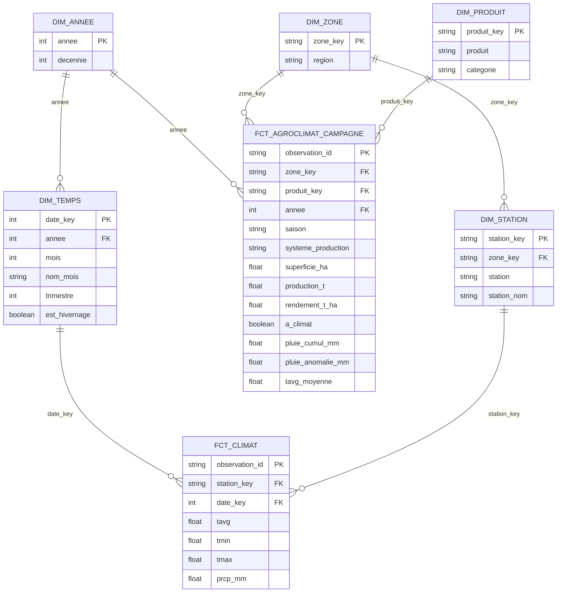

# DataFlow360 — Modélisation dbt pour Power BI

### Le modèle en constellation qui alimente le dashboard et la carte (US01, US11)

> **Statut : proposition de conception — pas encore implémentée.**
> Ce document décrit les ajustements dbt et le modèle sémantique Power BI à construire au-dessus des marts existants, décrits dans [README_dbt_staging.md](README_dbt_staging.md).

---

## Sommaire

- [1. Principes](#1-principes)
- [2. Le modèle cible](#2-le-modèle-cible)
- [3. Ce qu'il faut changer dans dbt](#3-ce-quil-faut-changer-dans-dbt)
- [4. Les relations dans Power BI](#4-les-relations-dans-power-bi)
- [5. Les mesures DAX](#5-les-mesures-dax)
- [6. Les pages du rapport](#6-les-pages-du-rapport)
- [7. Connexion à Snowflake](#7-connexion-à-snowflake)

---

## 1. Principes

| Principe | Décision | Pourquoi |
|---|---|---|
| Forme du modèle | **Constellation** : des dimensions autour de faits | C'est la forme pour laquelle le moteur de Power BI et le DAX sont conçus : filtres simples, calculs rapides |
| Ce qu'on importe | **Dimensions et faits**, pas les marts pré-agrégés | Un mart `région × année` ne peut plus être filtré par produit ou par saison. Le fait détaillé permet tous les croisements ; les agrégations se font en DAX. Les marts restent utiles pour l'API. |
| Calculs | **Dans dbt** ce qui est figé (attributs, catégories) ; **en DAX** ce qui dépend des filtres (totaux, rendement pondéré, évolutions) | Une même règle n'est écrite qu'une fois, au bon endroit |
| Mode de stockage | **Import** | Volume faible (~10 000 campagnes, quelques milliers de relevés mensuels) : l'import est plus rapide et n'interroge pas Snowflake à chaque clic |
| Nommage | Tables et colonnes renommées en français lisible dans Power BI, clés masquées | Le rapport est utilisé par des acteurs agricoles, pas par des développeurs |

---

## 2. Le modèle cible

Deux faits à des grains différents, reliés par des dimensions partagées :

- **Campagnes** — une ligne par campagne agricole, avec le résumé de son climat (`fct_agroclimat_campagne`).
- **Climat mensuel** — une ligne par station et par mois (`fct_climat`).



**Pourquoi une `dim_annee` en plus de `dim_temps` :** les campagnes sont annuelles (année de récolte), le climat est mensuel. Une dimension au grain de l'année, en tête des deux, permet à un seul segment « Année » de filtrer les deux faits en même temps : `dim_annee → fct_agroclimat_campagne` d'un côté, `dim_annee → dim_temps → fct_climat` de l'autre.

**Pourquoi le climat se filtre par région :** `dim_zone → dim_station → fct_climat`. Cliquer sur Kaolack sur la carte filtre à la fois les campagnes de Kaolack et les relevés de la station de Kaolack, sans relation directe entre les deux faits.

---

## 3. Ce qu'il faut changer dans dbt

| Modèle | Changement | Raison |
|---|---|---|
| `fct_agroclimat_campagne` | **Nouveau** (marts) | Campagne + climat de la campagne. Conçu avec le ML, voir [README_modelisation_ml.md § 6](README_modelisation_ml.md#6-les-modèles-dbt-à-créer). Remplace `fct_agriculture` dans Power BI. |
| `dim_annee` | **Nouveau** | Dimension partagée par les deux faits |
| `dim_temps` | **Calendrier complet** + mois en français + hivernage | Aujourd'hui elle ne contient que les mois présents dans le climat : un mois sans relevé disparaît des axes au lieu d'apparaître vide |
| `dim_zone` | Région contrôlée par le seed `seed_regions` | Une région mal orthographiée serait mal placée sur la carte |
| `dim_produit` | + catégorie (seed) | Segment « Céréales / Légumineuses / Cultures industrielles » |

### `dim_annee`

```sql
-- models/marts/dim_annee.sql
-- Dimension année : une ligne par année, partagée par les campagnes
-- (année de récolte) et le climat (via dim_temps).

SELECT DISTINCT
    annee,
    FLOOR(annee / 10) * 10 AS decennie
FROM {{ ref('dim_temps') }}
```

### `dim_temps` — calendrier complet

Elle couvre désormais toutes les années présentes **dans l'agriculture ou le climat**, mois par mois, même sans relevé. `date_key` garde la même forme (`annee * 100 + mois`) : `fct_climat` et ses tests ne changent pas.

```sql
-- models/marts/dim_temps.sql
-- Dimension temps : un calendrier mensuel complet couvrant
-- les années des données agricoles et climatiques.

WITH bornes AS (

    SELECT
        MIN(annee) AS annee_min,
        MAX(annee) AS annee_max
    FROM (
        SELECT annee FROM {{ ref('stg_climat') }}
        UNION ALL
        SELECT annee_reference FROM {{ ref('int_agriculture') }}
    )
),

annees AS (

    SELECT b.annee_min + g.n AS annee
    FROM bornes AS b
    CROSS JOIN (
        SELECT ROW_NUMBER() OVER (ORDER BY SEQ4()) - 1 AS n
        FROM TABLE(GENERATOR(ROWCOUNT => 200))
    ) AS g
    WHERE b.annee_min + g.n <= b.annee_max
),

mois AS (

    SELECT ROW_NUMBER() OVER (ORDER BY SEQ4()) AS mois
    FROM TABLE(GENERATOR(ROWCOUNT => 12))
)

SELECT
    (a.annee * 100 + m.mois) AS date_key,
    a.annee,
    m.mois,

    DECODE(m.mois,
        1, 'Janvier',  2, 'Février',  3, 'Mars',      4, 'Avril',
        5, 'Mai',      6, 'Juin',     7, 'Juillet',   8, 'Août',
        9, 'Septembre', 10, 'Octobre', 11, 'Novembre', 12, 'Décembre'
    ) AS nom_mois,

    QUARTER(DATE_FROM_PARTS(a.annee, m.mois, 1)) AS trimestre,

    -- Saison des pluies au Sénégal : juin à octobre.
    m.mois BETWEEN 6 AND 10 AS est_hivernage

FROM annees AS a
CROSS JOIN mois AS m
```

Dans Power BI, trier `nom_mois` par `mois` (*Trier par colonne*), sinon les mois s'affichent par ordre alphabétique.

### Seeds — données de référence

Deux petits fichiers CSV versionnés dans `dbt_project/seeds/`, chargés par `dbt seed` :

```csv
region
Dakar
Diourbel
Fatick
Kaffrine
Kaolack
Kedougou
Kolda
Louga
Matam
Saint-Louis
Sedhiou
Tambacounda
Thies
Ziguinchor
```

*`seeds/seed_regions.csv` — la liste de référence des 14 régions, écrite **exactement** comme dans les données agricoles (noms sans accent, comme dans `dim_station`). Le seed ne contient que la région : toutes les régions n'ont pas de station climatique, mais toutes ont des données agricoles, et c'est la région qui sert de clé commune.*

```csv
produit,categorie
Arachide (en coque),Légumineuses et oléagineux
Mil,Céréales
...
```

*`seeds/seed_produits.csv` — à compléter à partir de `SELECT produit FROM dim_produit`.*

`dim_produit` joint `seed_produits` en `LEFT JOIN`, avec un test `not_null` en `warn` sur `categorie` : un produit absent du seed est signalé au lieu de disparaître du segment. `dim_zone` ne change pas ; un test `relationships` en `warn` vérifie que chacune de ses régions existe dans `seed_regions`.

```sql
-- models/marts/dim_zone.sql
SELECT DISTINCT
    MD5(region) AS zone_key,
    region
FROM {{ ref('int_agriculture') }}
WHERE region IS NOT NULL
```

---

## 4. Les relations dans Power BI

| De (côté 1) | Vers (côté plusieurs) | Colonne | Direction du filtre |
|---|---|---|---|
| Année | Calendrier | `annee` | Simple |
| Année | Campagnes | `annee` | Simple |
| Calendrier | Climat mensuel | `date_key` | Simple |
| Région | Station | `zone_key` | Simple |
| Région | Campagnes | `zone_key` | Simple |
| Station | Climat mensuel | `station_key` | Simple |
| Produit | Campagnes | `produit_key` | Simple |

- **Toutes les relations en direction simple**, des dimensions vers les faits. Une direction « Les deux » crée des chemins de filtre ambigus et des totaux faux.
- **Aucune relation entre faits.** Campagnes et Climat mensuel se croisent uniquement via Année et Région.
- **Masquer** toutes les clés (`*_key`, `observation_id`) et les colonnes numériques des faits : l'utilisateur ne manipule que des mesures.
- Côté `fct_climat`, le produit n'a pas de sens : un segment Produit ne filtre pas le climat, c'est normal.

---

## 5. Les mesures DAX

Regrouper les mesures dans une table vide dédiée, `_Mesures`.

### Production

```dax
Production (t) = SUM ( Campagnes[production_t] )

Superficie (ha) = SUM ( Campagnes[superficie_ha] )

Rendement (t/ha) = DIVIDE ( [Production (t)], [Superficie (ha)] )

Nb campagnes = COUNTROWS ( Campagnes )
```

> **Rendement pondéré, pas moyenne des rendements.** `Rendement (t/ha)` divise la production totale par la surface totale. Les marts actuels (`mart_production_*_annee.rendement_moyen_t_ha`) font une moyenne simple : une parcelle d'1 ha y pèse autant qu'une de 10 000 ha, ce qui fausse le résultat. Ne pas reprendre ces colonnes dans le dashboard.

### Évolution

```dax
Rendement N-1 (t/ha) =
VAR AnneeCourante = SELECTEDVALUE ( 'Année'[annee] )
RETURN
    CALCULATE ( [Rendement (t/ha)], 'Année'[annee] = AnneeCourante - 1 )

Évolution rendement % =
DIVIDE ( [Rendement (t/ha)] - [Rendement N-1 (t/ha)], [Rendement N-1 (t/ha)] )
```

### Climat

```dax
-- Pluie d'une station moyenne : évite de compter double
-- les régions qui ont deux stations (Dakar, Saint-Louis, Ziguinchor).
Pluie (mm) =
AVERAGEX (
    VALUES ( 'Station'[station_key] ),
    CALCULATE ( SUM ( 'Climat mensuel'[prcp_mm] ) )
)

Température moyenne (°C) = AVERAGE ( 'Climat mensuel'[tavg] )

Température max (°C) = MAX ( 'Climat mensuel'[tmax] )
```

### Agroclimat

```dax
Pluie de campagne (mm) = AVERAGE ( Campagnes[pluie_cumul_mm] )

Anomalie de pluie (mm) = AVERAGE ( Campagnes[pluie_anomalie_mm] )

Couverture climatique % =
DIVIDE (
    CALCULATE ( [Nb campagnes], Campagnes[a_climat] = TRUE () ),
    [Nb campagnes]
)
```

---

## 6. Les pages du rapport

| Page | Question à laquelle elle répond | Visuels | Mesures |
|---|---|---|---|
| **1. Vue d'ensemble** | Où en est la production nationale ? | Cartes KPI, courbe production et rendement par année, top produits | Production, Superficie, Rendement, Évolution % |
| **2. Carte** | Quelles régions produisent et rendent le plus ? | Carte (régions placées par leur nom, taille = production, couleur = rendement), tableau des régions | Production, Rendement, Évolution % |
| **3. Climat** | Comment le climat évolue-t-il ? | Pluie mensuelle par année (barres), températures (courbes), heatmap mois × année des pluies | Pluie, Températures |
| **4. Agroclimat** | La pluie explique-t-elle le rendement ? | Nuage de points pluie de campagne × rendement par produit, anomalie de pluie par année | Pluie de campagne, Anomalie, Rendement, Couverture % |

**Segments communs** (synchronisés sur toutes les pages) : Année, Région, Produit, Catégorie de produit, Système de production.

**Carte :** le visuel *Carte* ou *Azure Maps* place les régions par leur nom. Dans Power BI, déclarer la catégorie de données *État ou province* sur `region`, et ajouter une colonne calculée `Lieu = 'Région'[region] & ", Sénégal"` à utiliser comme emplacement, pour éviter qu'une région soit confondue avec un lieu homonyme d'un autre pays. Pour une carte choroplèthe (régions coloriées), utiliser *Shape Map* avec un fichier TopoJSON des régions du Sénégal, en joignant sur le nom de la région.

**Page 4 :** afficher `Couverture climatique %` à côté du nuage de points. Seules 59 % des campagnes ont un climat ; sans cette indication, le lecteur croirait que le nuage représente toute la production.

---

## 7. Connexion à Snowflake

| Paramètre | Valeur |
|---|---|
| Connecteur | Snowflake (natif Power BI) |
| Entrepôt | `DATAFLOW360_WH` |
| Base / schémas | `DATAFLOW360` — `MARTS` |
| Mode | Import, actualisation planifiée après le `dbt build` quotidien |
| Compte | **Compte de service dédié** avec un rôle en lecture seule sur `MARTS` |

**Pourquoi un compte de service :** le profil dbt actuel utilise `username_password_mfa`. Une actualisation planifiée dans le service Power BI ne peut pas valider une notification MFA : elle échouerait systématiquement. Il faut un utilisateur Snowflake dédié, sans MFA interactive, avec un rôle limité. La méthode d'authentification (paire de clés, Microsoft Entra ID SSO, ou mot de passe avec politique réseau restrictive) est à choisir selon ce que supportent le connecteur Power BI et la politique de sécurité du compte Snowflake — à vérifier avec l'administrateur Snowflake.

```sql
CREATE ROLE IF NOT EXISTS POWERBI_READER;
GRANT USAGE ON WAREHOUSE DATAFLOW360_WH TO ROLE POWERBI_READER;
GRANT USAGE ON DATABASE DATAFLOW360 TO ROLE POWERBI_READER;
GRANT USAGE ON SCHEMA DATAFLOW360.MARTS TO ROLE POWERBI_READER;
GRANT SELECT ON ALL TABLES IN SCHEMA DATAFLOW360.MARTS TO ROLE POWERBI_READER;
GRANT SELECT ON FUTURE TABLES IN SCHEMA DATAFLOW360.MARTS TO ROLE POWERBI_READER;
```

Le `GRANT ... ON FUTURE TABLES` est nécessaire : `dbt build` recrée les tables des marts à chaque exécution, et sans lui le rôle perdrait ses droits après chaque build.
