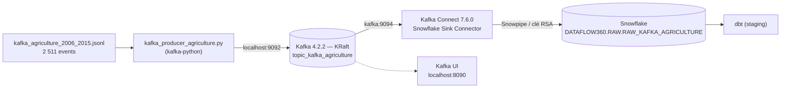

# Source 4 — Kafka (ingestion streaming)

Ingestion en **streaming** des données de production agricole du Sénégal (2006–2015) vers **Snowflake**, via **Apache Kafka** et le **Snowflake Connector for Kafka**.

Ce module correspond à la brique *« Source 4 — Kafka · ELT streaming »* de l'architecture globale du projet Assaman & Suuf : les données arrivent brutes dans Snowflake (`DATAFLOW360.RAW`) et sont ensuite transformées par dbt.

---

## Sommaire

- [Architecture](#-architecture)
- [Contenu du dossier](#-contenu-du-dossier)
- [Données](#-données)
- [Infrastructure Docker](#-infrastructure-docker)
- [Prérequis Snowflake](#-prérequis-snowflake)
- [Mise en route](#-mise-en-route)
- [Producteur Kafka](#-producteur-kafka)
- [Connecteur Snowflake](#-connecteur-snowflake)
- [Vérifications](#-vérifications)
- [Dépannage](#-dépannage)
- [Sécurité](#-sécurité)
- [Points d'attention](#-points-dattention)

---

## Architecture



| Étape | Composant | Rôle |
|---|---|---|
| 1 | `kafka_producer_agriculture.py` | Rejoue le fichier JSONL ligne par ligne et publie chaque event sur le topic |
| 2 | Kafka (conteneur `dataflow360-kafka`) | Broker unique en mode KRaft (sans Zookeeper), stocke les events |
| 3 | Kafka Connect (`dataflow360-kafka-connect`) | Héberge le Snowflake Sink Connector, consomme le topic |
| 4 | Snowflake Sink Connector | Bufferise puis charge les messages dans la table brute Snowflake |
| 5 | Kafka UI (`dataflow360-kafka-ui`) | Interface web pour inspecter topics, messages et consumer groups |

---

## Contenu du dossier

```
ingestion/kafka_source/
├── README.md                                   # cette documentation
├── __init__.py
├── .gitignore                                  # exclut les clés RSA, venv, .env
├── kafka_producer_agriculture.py               # producteur Kafka (rejeu JSONL)
├── deploy_snowflake_connector.sh               # déploie le connecteur via l'API REST Kafka Connect
├── snowflake_connector_agriculture.properties  # config du connecteur (format .properties)
├── data/
│   └── kafka_agriculture_2006_2015.jsonl       # jeu de données source
├── plugins/
│   └── snowflake-kafka-connector/
│       └── snowflake-kafka-connector.jar       # plugin monté dans Kafka Connect (~155 Mo)
├── snowflake_kafka.p8                          # clé privée RSA (NON versionnée)
└── snowflake_kafka.pub                         # clé publique RSA (NON versionnée)
```

Le fichier `docker-compose.yml` qui démarre l'infrastructure se trouve à la **racine du dépôt**.

---

## Données

**Fichier :** `data/kafka_agriculture_2006_2015.jsonl` — un event JSON par ligne :

```json
{
  "key": "SN2008A20103_Manioc_Principale_2010",
  "data": {
    "fnid": "SN2008A20103",
    "region": "Dakar",
    "departement": "Rufisque",
    "produit": "Manioc",
    "saison": "Principale",
    "annee_semis": 2010,
    "mois_semis": 6,
    "annee_recolte": 2010,
    "mois_recolte": 11,
    "systeme_production": "None",
    "indicateur_qualite": 0,
    "superficie_ha": 546.0,
    "production_t": 4641.0,
    "rendement_t_ha": 8.5
  }
}
```

- `key` → devient la **clé Kafka** (format `fnid_produit_saison_annee`).
- `data` → devient la **valeur Kafka** (JSON sérialisé en UTF-8).

### Dictionnaire des champs

| Champ | Type | Description |
|---|---|---|
| `fnid` | string | Identifiant de l'unité administrative (département) |
| `region` | string | Région du Sénégal (14 régions) |
| `departement` | string | Département (43 départements) |
| `produit` | string | Culture (10 produits) |
| `saison` | string | `Principale` ou `Contre-saison` |
| `annee_semis` / `mois_semis` | int | Date de semis |
| `annee_recolte` / `mois_recolte` | int | Date de récolte |
| `systeme_production` | string | `None`, `irrigué` ou `décrue (PS)` |
| `indicateur_qualite` | int | Indicateur de qualité de la donnée (0, 1 ou 2) |
| `superficie_ha` | float | Superficie cultivée (hectares) |
| `production_t` | float | Production (tonnes) |
| `rendement_t_ha` | float | Rendement (tonnes / hectare) |

### Profil du jeu de données

| Indicateur | Valeur |
|---|---|
| Nombre d'events | **2 511** |
| Clés uniques | 2 501 (10 clés en double, voir [Points d'attention](#-points-dattention)) |
| Période (récolte) | 2006 → 2015 |
| Régions / départements | 14 / 43 |
| Produits | Arachide (en coque), Sorgho, Niébé, Mil, Maïs, Riz, Manioc, Sésame, Fonio, Patate douce |
| Saisons | Principale (2 497), Contre-saison (14) |
| Valeurs nulles | `superficie_ha` : 3 · `production_t` : 3 · `rendement_t_ha` : 6 |

---

## 🐳 Infrastructure Docker

Trois services sont définis dans `docker-compose.yml` (racine du dépôt) :

| Service | Image | Port(s) hôte | Rôle |
|---|---|---|---|
| `kafka` | `apache/kafka:4.2.2` | `9092` (hôte), `9094` (interne) | Broker + contrôleur KRaft |
| `kafka-ui` | `provectuslabs/kafka-ui:latest` | `8090` | Interface web |
| `kafka-connect` | `confluentinc/cp-kafka-connect:7.6.0` | `8083` | API REST Kafka Connect |

**Listeners Kafka :**

| Listener | Adresse | Utilisé par |
|---|---|---|
| `PLAINTEXT` | `localhost:9092` | Le producteur Python lancé depuis l'hôte |
| `INTERNAL` | `kafka:9094` | Kafka UI et Kafka Connect (réseau Docker) |
| `CONTROLLER` | `kafka:9093` | Quorum KRaft (interne) |

**Choix de configuration :**
- **Mode KRaft** : plus besoin de Zookeeper.
- `CLUSTER_ID` fixe : redémarrages cohérents en local.
- `KAFKA_AUTO_CREATE_TOPICS_ENABLE=true` : le topic `topic_kafka_agriculture` est créé à la première publication (1 partition).
- Facteurs de réplication à `1` : un seul broker en local.
- Le dossier `plugins/` est monté dans Kafka Connect sur `/etc/kafka-connect/jars`.
- Volume `kafka_data` : les messages survivent à un `docker compose down` (mais pas à `down -v`).

---

## Prérequis Snowflake

Le connecteur s'authentifie par **paire de clés RSA** (pas de mot de passe). Objets attendus côté Snowflake :

| Objet | Valeur |
|---|---|
| Compte | `whpmweu-sy84726` |
| Utilisateur | `kafka_connector_user` |
| Rôle | `KAFKA_CONNECTOR_ROLE` |
| Base / schéma | `DATAFLOW360.RAW` |
| Table cible | `RAW_KAFKA_AGRICULTURE` (créée automatiquement par le connecteur) |

### 1. Générer la paire de clés

```bash
cd ingestion/kafka_source
openssl genrsa 2048 | openssl pkcs8 -topk8 -inform PEM -out snowflake_kafka.p8 -nocrypt
openssl rsa -in snowflake_kafka.p8 -pubout -out snowflake_kafka.pub
```

### 2. Configurer Snowflake (exemple de script, rôle `SECURITYADMIN` / `ACCOUNTADMIN`)

```sql
CREATE ROLE IF NOT EXISTS KAFKA_CONNECTOR_ROLE;
CREATE USER IF NOT EXISTS kafka_connector_user DEFAULT_ROLE = KAFKA_CONNECTOR_ROLE;
GRANT ROLE KAFKA_CONNECTOR_ROLE TO USER kafka_connector_user;

-- Coller le contenu de snowflake_kafka.pub SANS les lignes BEGIN/END
ALTER USER kafka_connector_user SET RSA_PUBLIC_KEY = 'MIIBIjANBgkqh...';

GRANT USAGE ON DATABASE DATAFLOW360 TO ROLE KAFKA_CONNECTOR_ROLE;
GRANT USAGE ON SCHEMA DATAFLOW360.RAW TO ROLE KAFKA_CONNECTOR_ROLE;
GRANT CREATE TABLE, CREATE STAGE, CREATE PIPE ON SCHEMA DATAFLOW360.RAW TO ROLE KAFKA_CONNECTOR_ROLE;
```

> Les privilèges `CREATE TABLE / STAGE / PIPE` sont nécessaires : le connecteur crée lui-même la table, un stage interne et un pipe Snowpipe.

---

## Mise en route

Toutes les commandes sont lancées depuis la **racine du dépôt**, sauf mention contraire.

### 1. Démarrer l'infrastructure

```bash
docker compose up -d
docker compose ps          # kafka doit être "healthy"
```

Kafka Connect attend que Kafka soit `healthy`, puis met ~30–60 s à démarrer. Vérifier qu'il répond et que le plugin est chargé :

```bash
curl -s http://localhost:8083/connector-plugins | grep -i snowflake
```

### 2. Installer les dépendances Python

```bash
python -m venv venv && source venv/bin/activate
pip install -r ingestion/requirements.txt     # contient kafka-python
```

### 3. Déployer le connecteur Snowflake

```bash
cd ingestion/kafka_source
chmod +x deploy_snowflake_connector.sh
./deploy_snowflake_connector.sh ./snowflake_kafka.p8
```

Le script extrait la clé privée du fichier `.p8` (en retirant les lignes `BEGIN/END` et les retours à la ligne), envoie la configuration à `POST /connectors` puis affiche le statut du connecteur. Le statut attendu est `RUNNING` pour le connecteur **et** sa tâche.

### 4. Publier les données

```bash
# Test à blanc, sans broker
python kafka_producer_agriculture.py --file data/kafka_agriculture_2006_2015.jsonl --dry-run

# Envoi réel, le plus vite possible
python kafka_producer_agriculture.py --file data/kafka_agriculture_2006_2015.jsonl

# Envoi « au fil de l'eau » (1 event toutes les 50 ms ≈ 2 min pour tout le fichier)
python kafka_producer_agriculture.py --file data/kafka_agriculture_2006_2015.jsonl --delay 0.05
```

### 5. Vérifier dans Snowflake

Les données apparaissent après le flush du buffer (au plus **60 s** après le dernier message, voir [Connecteur Snowflake](#-connecteur-snowflake)).

---

## Producteur Kafka

`kafka_producer_agriculture.py` lit le fichier JSONL et publie chaque event sur Kafka.

### Options CLI

| Option | Défaut | Description |
|---|---|---|
| `--file` | *(obligatoire)* | Chemin du fichier JSONL à rejouer |
| `--topic` | `topic_kafka_agriculture` | Topic cible |
| `--bootstrap-servers` | `localhost:9092` | Adresse(s) du broker |
| `--delay` | `0.0` | Pause (s) entre deux envois, pour simuler un flux |
| `--dry-run` | `False` | Lit et journalise les events sans rien envoyer |

### Configuration du producteur

| Paramètre | Valeur | Raison |
|---|---|---|
| `acks` | `all` | Un message n'est confirmé qu'une fois écrit par tous les réplicas in-sync : durabilité maximale |
| `retries` | `5` | Réessaie automatiquement en cas d'erreur transitoire |
| `linger_ms` | `50` | Regroupe les messages en lots pour de meilleures performances |
| `key_serializer` | UTF-8 | La clé `fnid_produit_saison_annee` garantit l'ordre par clé (même partition) |
| `value_serializer` | JSON UTF-8 (`ensure_ascii=False`) | Préserve les accents (`Niébé`, `Maïs`, `irrigué`…) |

### Gestion des erreurs

- Ligne vide → ignorée silencieusement.
- JSON invalide ou champ `key`/`data` manquant → ligne ignorée, avertissement journalisé, compteur d'erreurs incrémenté.
- Échec d'envoi Kafka → journalisé via le callback `on_send_error`.
- Fichier introuvable ou `KafkaError` → code de sortie `1`.
- En fin d'exécution : `flush()` (timeout 30 s), puis résumé `N events publiés, M lignes en erreur`.

---

## 🔌 Connecteur Snowflake

Configuration déployée par `deploy_snowflake_connector.sh` (identique à `snowflake_connector_agriculture.properties`) :

| Paramètre | Valeur |
|---|---|
| `name` | `snowflake-agriculture-sink` |
| `connector.class` | `com.snowflake.kafka.connector.SnowflakeSinkConnector` |
| `tasks.max` | `1` (une seule partition) |
| `topics` | `topic_kafka_agriculture` |
| `snowflake.topic2table.map` | `topic_kafka_agriculture:raw_kafka_agriculture` |
| `key.converter` | `StringConverter` |
| `value.converter` | `SnowflakeJsonConverter` |
| `buffer.count.records` | `1000` |
| `buffer.flush.time` | `60` (secondes) |
| `buffer.size.bytes` | `5000000` (5 Mo) |

Le buffer est vidé vers Snowflake dès que **l'un** des trois seuils est atteint (1 000 enregistrements, 60 s ou 5 Mo).

### Structure de la table brute

Le connecteur crée la table avec deux colonnes `VARIANT` :

| Colonne | Contenu |
|---|---|
| `RECORD_METADATA` | Métadonnées Kafka : `topic`, `partition`, `offset`, `key`, `CreateTime`… |
| `RECORD_CONTENT` | Le JSON de l'event (champ `data` du fichier) |

---

## Vérifications

### Côté Kafka

```bash
# Lister les topics
docker exec dataflow360-kafka /opt/kafka/bin/kafka-topics.sh \
  --bootstrap-server localhost:9092 --list

# Nombre de messages dans le topic (offset de fin)
docker exec dataflow360-kafka /opt/kafka/bin/kafka-get-offsets.sh \
  --bootstrap-server localhost:9092 --topic topic_kafka_agriculture

# Lire les 5 premiers messages avec leur clé
docker exec dataflow360-kafka /opt/kafka/bin/kafka-console-consumer.sh \
  --bootstrap-server localhost:9092 --topic topic_kafka_agriculture \
  --from-beginning --max-messages 5 --property print.key=true
```

Ou via l'interface web : **http://localhost:8090**.

### Côté Kafka Connect

```bash
curl -s http://localhost:8083/connectors                                        # liste
curl -s http://localhost:8083/connectors/snowflake-agriculture-sink/status      # statut
curl -s -X POST http://localhost:8083/connectors/snowflake-agriculture-sink/restart   # redémarrer
curl -s -X DELETE http://localhost:8083/connectors/snowflake-agriculture-sink   # supprimer
```

### Côté Snowflake

```sql
USE ROLE KAFKA_CONNECTOR_ROLE;
USE SCHEMA DATAFLOW360.RAW;

-- Volume chargé (attendu : 2 511 après un rejeu complet)
SELECT COUNT(*) FROM RAW_KAFKA_AGRICULTURE;

-- Aperçu à plat
SELECT
    RECORD_METADATA:key::STRING               AS event_key,
    RECORD_METADATA:offset::INT               AS kafka_offset,
    RECORD_CONTENT:region::STRING             AS region,
    RECORD_CONTENT:produit::STRING            AS produit,
    RECORD_CONTENT:annee_recolte::INT         AS annee_recolte,
    RECORD_CONTENT:production_t::FLOAT        AS production_t,
    RECORD_CONTENT:rendement_t_ha::FLOAT      AS rendement_t_ha
FROM RAW_KAFKA_AGRICULTURE
LIMIT 10;
```

---

## 🛠️ Dépannage

| Symptôme | Cause probable | Solution |
|---|---|---|
| `NoBrokersAvailable` au lancement du producteur | Kafka pas démarré ou pas encore `healthy` | `docker compose ps`, attendre le healthcheck |
| `curl: (7) Failed to connect to localhost port 8083` | Kafka Connect encore en démarrage | Attendre ~1 min, `docker logs -f dataflow360-kafka-connect` |
| Plugin Snowflake absent de `/connector-plugins` | JAR absent du dossier `plugins/` | Vérifier `plugins/snowflake-kafka-connector/*.jar` puis `docker compose restart kafka-connect` |
| Tâche du connecteur en `FAILED` avec `JWT token is invalid` | Clé publique non enregistrée ou mal copiée dans Snowflake | Refaire `ALTER USER ... SET RSA_PUBLIC_KEY` |
| `Insufficient privileges` | Droits manquants pour `KAFKA_CONNECTOR_ROLE` | Refaire les `GRANT` de la section Prérequis |
| `409 Conflict` au déploiement | Le connecteur existe déjà | Le supprimer (`DELETE`) puis relancer le script |
| Table vide juste après l'envoi | Buffer pas encore vidé | Attendre 60 s (`buffer.flush.time`) |
| Données en double dans Snowflake | Fichier rejoué plusieurs fois | Normal : Kafka est un journal en ajout seul, dédoublonner en staging dbt |

---

## Sécurité

- `snowflake_kafka.p8` et `snowflake_kafka.pub` sont exclus via `.gitignore` (local et racine). **Ne jamais les committer.**
- Le script de déploiement lit la clé privée depuis un fichier passé en argument : elle n'apparaît dans aucun fichier versionné.
- **`snowflake_connector_agriculture.properties` contient la clé privée en clair** et n'est **pas** ignoré par git. Avant tout commit, remplacer la valeur par un placeholder (`snowflake.private.key=<A_RENSEIGNER>`) ou ajouter le fichier au `.gitignore`. Si la clé a déjà été poussée, la **révoquer** et en générer une nouvelle.
- La clé privée est générée sans passphrase (`-nocrypt`) : acceptable en local, à éviter en production.

---

## Points d'attention

1. **Clés en double dans le jeu de données** — 10 clés apparaissent deux fois (ex. `SN2008A21702_Sorgho_Principale_2008`). Les deux lignes diffèrent par `systeme_production` (`irrigué` / `décrue (PS)` vs `None`). La clé Kafka n'inclut pas ce champ : les modèles dbt doivent soit l'intégrer à la clé métier, soit agréger ces lignes.
2. **`"None"` est une chaîne**, pas un `null` JSON, dans `systeme_production` : à convertir en `NULL` en staging.
3. **Valeurs manquantes** — 3 `superficie_ha`, 3 `production_t` et 6 `rendement_t_ha` sont nuls.
4. **Pas d'idempotence de bout en bout** — relancer le producteur republie tout ; le connecteur garantit l'exactly-once *par offset*, pas par clé métier. Dédoublonner en aval (ex. `QUALIFY ROW_NUMBER() OVER (PARTITION BY event_key ORDER BY kafka_offset DESC) = 1`).
5. **JAR de ~155 Mo** dans `plugins/` — il dépasse la limite de 100 Mo de GitHub : l'ajouter au `.gitignore` et documenter son téléchargement plutôt que de le versionner.
6. **Version du connecteur non figée** — `kafka-ui:latest` et le JAR sans numéro de version rendent l'environnement moins reproductible.
