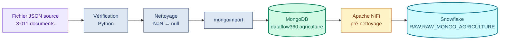
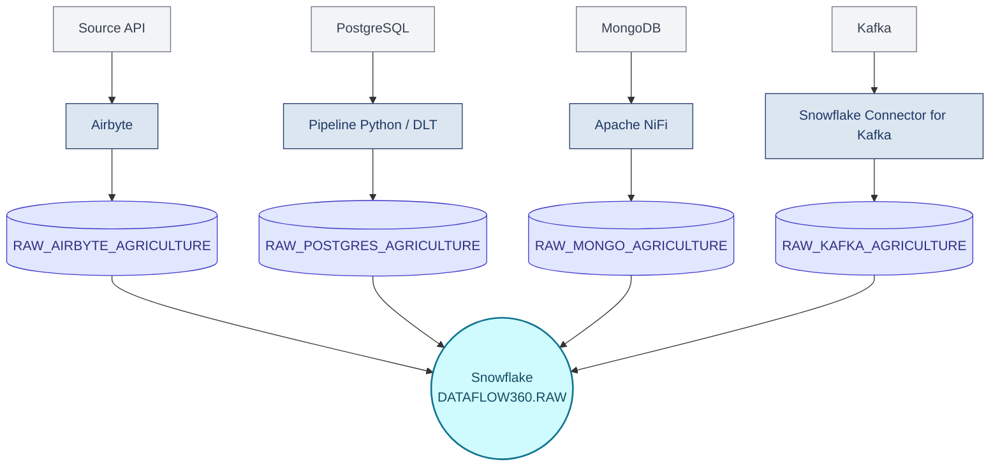
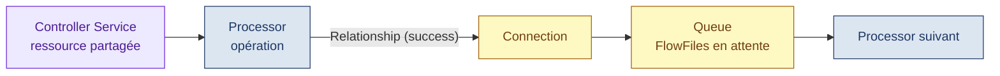
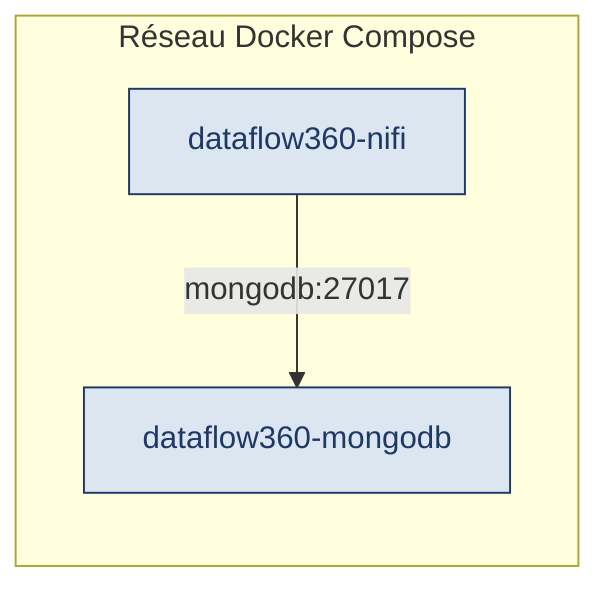
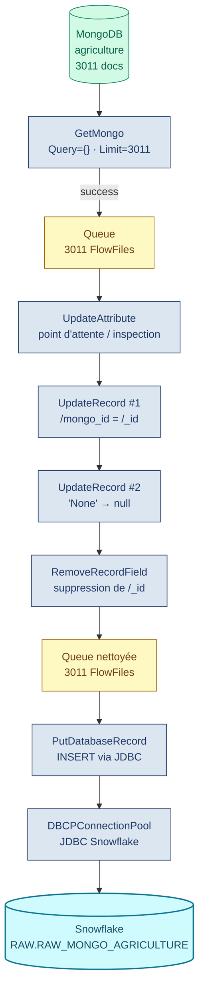
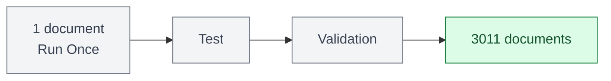
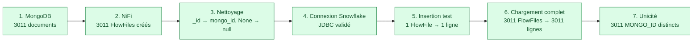
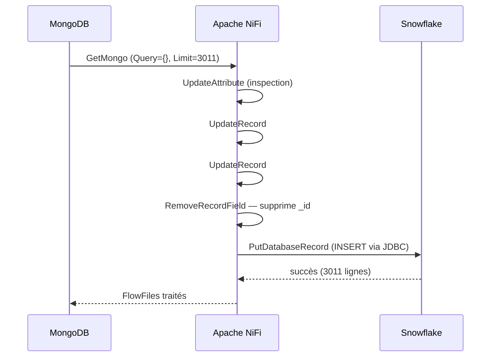
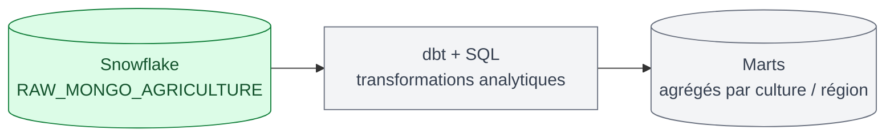

<div align="center">

# DataFlow360 — Ingestion MongoDB → Apache NiFi → Snowflake

### Branche MongoDB du pipeline d'ingestion agricole — Assaman & Suuf

[](#)
[](#)
[](#)
[](#)

Ingestion de **3 011 observations agricoles** (1990–2005) depuis MongoDB jusqu'à la zone RAW de Snowflake, via un pipeline de pré-nettoyage NiFi.

</div>

---

## Sommaire

- [1. Vue d'ensemble](#1-vue-densemble)
- [2. Architecture globale DataFlow360](#2-architecture-globale-dataflow360)
- [Partie A — Source MongoDB](#partie-a--source-mongodb)
  - [A.1 Structure du dossier](#a1-structure-du-dossier)
  - [A.2 Démarrer MongoDB](#a2-démarrer-mongodb)
  - [A.3 Nettoyer le fichier source](#a3-nettoyer-le-fichier-source)
  - [A.4 Importer dans MongoDB](#a4-importer-dans-mongodb)
  - [A.5 Vérifier l'import](#a5-vérifier-limport)
- [Partie B — Pipeline Apache NiFi](#partie-b--pipeline-apache-nifi)
  - [B.1 Vocabulaire NiFi essentiel](#b1-vocabulaire-nifi-essentiel)
  - [B.2 Environnement Docker](#b2-environnement-docker)
  - [B.3 Flux NiFi détaillé](#b3-flux-nifi-détaillé)
  - [B.4 Controller Services](#b4-controller-services)
  - [B.5 Processors, un par un](#b5-processors-un-par-un)
  - [B.6 Table et mapping Snowflake](#b6-table-et-mapping-snowflake)
  - [B.7 Tests et contrôles qualité](#b7-tests-et-contrôles-qualité)
- [3. Pipeline final](#3-pipeline-final)
- [4. Reprise après arrêt Docker](#4-reprise-après-arrêt-docker)
- [5. Prochaine étape](#5-prochaine-étape)

---

## 1. Vue d'ensemble



NiFi ne remplace ni MongoDB ni Snowflake : il lit, transporte, contrôle, transforme légèrement et charge. La modélisation analytique (dbt/SQL) intervient en aval, sur la zone RAW.

---

## 2. Architecture globale DataFlow360

MongoDB n'est qu'une des quatre sources du projet. Chacune alimente sa propre table RAW dans Snowflake.



Ce document couvre uniquement la branche **MongoDB → NiFi → Snowflake**, de bout en bout.

---

## Partie A — Source MongoDB

### A.1 Structure du dossier

```text
mongodb_source/
├── docker-compose.yml
├── mongo_agriculture_1990_2005.json    # source (3 011 docs)
├── clean_mongo.py                      # nettoie les NaN → null
├── mongo_agriculture_clean.json        # version importée
└── README.md
```

**Champs du document** (14) : `fnid`, `region`, `departement`, `produit`, `saison`, `annee_semis`, `mois_semis`, `annee_recolte`, `mois_recolte`, `systeme_production`, `indicateur_qualite`, `superficie_ha`, `production_t`, `rendement_t_ha`.

### A.2 Démarrer MongoDB

```yaml
# docker-compose.yml
services:
  mongodb:
    image: mongo:8
    container_name: dataflow360-mongodb
    restart: unless-stopped
    ports:
      - "27017:27017"
    environment:
      MONGO_INITDB_ROOT_USERNAME: admin
      MONGO_INITDB_ROOT_PASSWORD: dataflow360
    volumes:
      - mongodb_data:/data/db

volumes:
  mongodb_data:
```

```bash
cd ingestion/mongodb_source
docker compose up -d
docker ps   # doit lister dataflow360-mongodb
```

### A.3 Nettoyer le fichier source

Le premier import avec `mongoimport` a échoué : le fichier contenait des valeurs `NaN` (Not a Number), invalides en JSON strict.

```python
# clean_mongo.py
import json, math

with open("mongo_agriculture_1990_2005.json", encoding="utf-8") as f:
    data = json.load(f)

def nettoyer(v):
    return None if isinstance(v, float) and math.isnan(v) else v

for doc in data:
    for cle in doc:
        doc[cle] = nettoyer(doc[cle])

with open("mongo_agriculture_clean.json", "w", encoding="utf-8") as f:
    json.dump(data, f, ensure_ascii=False)

print(f"{len(data)} documents nettoyés.")
```

```bash
python3 clean_mongo.py
```

Le nombre de documents reste 3 011 : le nettoyage ne supprime rien, il remplace seulement les valeurs manquantes.

### A.4 Importer dans MongoDB

```bash
docker cp mongo_agriculture_clean.json dataflow360-mongodb:/tmp/agriculture.json

docker exec dataflow360-mongodb mongoimport \
  --username admin \
  --password dataflow360 \
  --authenticationDatabase admin \
  --db dataflow360 \
  --collection agriculture \
  --file /tmp/agriculture.json \
  --jsonArray
```

| Paramètre | Rôle |
|---|---|
| `--db dataflow360` | Base de destination |
| `--collection agriculture` | Collection de destination |
| `--jsonArray` | Le fichier est un tableau JSON `[{...}, {...}]`, pas un document par ligne |

### A.5 Vérifier l'import

```bash
docker exec -it dataflow360-mongodb mongosh \
  --username admin --password dataflow360 --authenticationDatabase admin \
  dataflow360 --eval 'db.agriculture.countDocuments()'
# → 3011

docker exec -it dataflow360-mongodb mongosh \
  --username admin --password dataflow360 --authenticationDatabase admin \
  dataflow360 --eval 'db.agriculture.findOne()'
# → un document complet, 14 champs
```

```text
MongoDB
└── dataflow360           (base)
    └── agriculture        (collection)
        └── 3011 documents
```

---

## Partie B — Pipeline Apache NiFi

### B.1 Vocabulaire NiFi essentiel

| Terme | Définition en une ligne |
|---|---|
| Processor | Composant qui réalise une opération (lire, transformer, écrire) |
| FlowFile | Unité de données qui circule dans NiFi — `Content` (la donnée) + `Attributes` (métadonnées) |
| Relationship | Sortie logique d'un Processor (`success`, `failure`, `retry`...) |
| Connection | Lien entre deux composants, qui porte une Relationship |
| Queue | File d'attente de FlowFiles sur une Connection |
| Back Pressure | Mécanisme qui limite l'accumulation de FlowFiles dans une Queue trop pleine |
| Controller Service | Service partagé et réutilisable (ex. une connexion) configuré une fois pour plusieurs Processors |
| Record Reader / Writer | Composants qui transforment respectivement un flux (JSON...) en Records exploitables, et l'inverse |
| Scheduling | Définit quand un Processor s'exécute (Timer Driven, CRON...) |
| Run Once | Exécute un Processor une seule fois — utile pour tester sur un seul FlowFile |



### B.2 Environnement Docker

MongoDB et NiFi tournent dans des conteneurs Docker isolés, décrits dans un unique `docker-compose.yml` à la racine du projet.

```text
assaman-suuf/
└── docker-compose.yml
```

| Volume | Contenu |
|---|---|
| `mongodb_source_mongodb_data` | Données MongoDB |
| `assaman-suuf_nifi_conf` | Configuration NiFi |
| `assaman-suuf_nifi_state` | État interne NiFi |
| `assaman-suuf_nifi_database` | Base de données interne NiFi |
| `assaman-suuf_nifi_flowfile` | Repository des FlowFiles |
| `assaman-suuf_nifi_content` | Repository du contenu |
| `assaman-suuf_nifi_provenance` | Historique de provenance |

| Commande | Effet |
|---|---|
| `docker compose down` | Supprime les conteneurs, **conserve** les volumes |
| `docker compose up -d` | Recrée les conteneurs, remonte les volumes existants |
| `docker compose down -v` | Supprime conteneurs **et** volumes — à éviter |

Réseau interne Docker Compose : NiFi s'adresse à MongoDB via le nom du service (`mongodb:27017`), jamais `localhost:27017` — les deux tournent dans des conteneurs distincts.



### B.3 Flux NiFi détaillé



**Pourquoi tester avec un seul FlowFile avant les 3 011 ?** `Run Once` permet de valider connexion, format, transformation, colonnes et types sur un document avant d'appliquer la même règle à tout le dataset — une transformation massive non validée au préalable est risquée.



### B.4 Controller Services

#### MongoDBControllerService

| Paramètre | Valeur |
|---|---|
| Mongo URI | `mongodb://mongodb:27017` |
| Database User | `admin` |
| Password | secret, non versionné |
| SSL Context Service | vide |
| Write Concern | `ACKNOWLEDGED` |

#### DBCPConnectionPool (JDBC Snowflake)

| Paramètre | Valeur |
|---|---|
| Database Connection URL | `jdbc:snowflake://WHPMWEU-SY84726.snowflakecomputing.com/?warehouse=DATAFLOW360_WH&db=DATAFLOW360&schema=RAW&role=SYSADMIN` |
| Warehouse | `DATAFLOW360_WH` |
| Database | `DATAFLOW360` |
| Schema | `RAW` |
| Role | `SYSADMIN` |
| Driver Class | `net.snowflake.client.api.driver.SnowflakeDriver` |
| Driver Artifact | `net.snowflake:snowflake-jdbc:4.3.4` |

> Le mot de passe n'est jamais documenté ni versionné dans Git.

Validation obtenue :

```text
Configure Data Source     → succès
Establish Connection      → succès
Component Validation      → succès
```

### B.5 Processors, un par un

| Processor | Rôle | Point clé de configuration |
|---|---|---|
| `GetMongo` | Lit les documents MongoDB, crée un FlowFile par document | `Query = {}` (aucun filtre) · `Limit = 3011` · `Results Per FlowFile = 1` |
| `UpdateAttribute` | Point d'arrêt temporaire pour inspecter la Queue avant transformation | Laissé arrêté volontairement le temps de l'inspection |
| `UpdateRecord` #1 | Ajoute `mongo_id` à partir de `_id` | `/mongo_id = /_id` (Record Path Value) |
| `UpdateRecord` #2 | Convertit la chaîne `"None"` en vrai `null` | `/systeme_production[. = 'None']` → valeur nulle |
| `RemoveRecordField` | Supprime le champ `_id`, devenu redondant | `Name: _id` / `Value: /_id` |
| `JsonTreeReader` | Lit le JSON entrant et en déduit la structure | `Schema Access Strategy = Infer Schema` |
| `JsonRecordSetWriter` | Réécrit les Records modifiés en JSON | `Output Grouping = Array` · `Schema Write Strategy = Do Not Write Schema` |
| `PutDatabaseRecord` | Convertit les Records en `INSERT` SQL vers Snowflake | `Database Type = Generic` · `Statement Type = INSERT` · `Table Name = RAW_MONGO_AGRICULTURE` |
| `LogAttribute` | Observe les attributs d'un FlowFile pendant les tests | Utilisé sur la branche `success` en phase de test |

**Avant / après transformation**, sur un document :

```json
// Avant
{
  "_id": "6abc7eb7e10d7b58435c1c5c",
  "fnid": "SN2008A20103",
  "systeme_production": "None",
  "production_t": 1508.0
}
```

```json
// Après
{
  "fnid": "SN2008A20103",
  "systeme_production": null,
  "production_t": 1508.0,
  "mongo_id": "6abc7eb7e10d7b58435c1c5c"
}
```

### B.6 Table et mapping Snowflake

```sql
CREATE OR REPLACE TABLE DATAFLOW360.RAW.RAW_MONGO_AGRICULTURE (
    FNID VARCHAR,
    REGION VARCHAR,
    DEPARTEMENT VARCHAR,
    PRODUIT VARCHAR,
    SAISON VARCHAR,
    ANNEE_SEMIS INTEGER,
    MOIS_SEMIS INTEGER,
    ANNEE_RECOLTE INTEGER,
    MOIS_RECOLTE INTEGER,
    SYSTEME_PRODUCTION VARCHAR,
    INDICATEUR_QUALITE INTEGER,
    SUPERFICIE_HA FLOAT,
    PRODUCTION_T FLOAT,
    RENDEMENT_T_HA FLOAT,
    MONGO_ID VARCHAR
);
```

| MongoDB / NiFi | Snowflake |
|---|---|
| `fnid` | `FNID` |
| `region` | `REGION` |
| `departement` | `DEPARTEMENT` |
| `produit` | `PRODUIT` |
| `saison` | `SAISON` |
| `annee_semis` | `ANNEE_SEMIS` |
| `mois_semis` | `MOIS_SEMIS` |
| `annee_recolte` | `ANNEE_RECOLTE` |
| `mois_recolte` | `MOIS_RECOLTE` |
| `systeme_production` | `SYSTEME_PRODUCTION` |
| `indicateur_qualite` | `INDICATEUR_QUALITE` |
| `superficie_ha` | `SUPERFICIE_HA` |
| `production_t` | `PRODUCTION_T` |
| `rendement_t_ha` | `RENDEMENT_T_HA` |
| `mongo_id` | `MONGO_ID` |

**Pourquoi cette table diffère de la table Kafka ?** Kafka charge via le Snowflake Connector dans une table `VARIANT` (`RECORD_METADATA`, `RECORD_CONTENT`), avec un Pipe Snowflake. La branche MongoDB passe par NiFi avec une connexion JDBC directe vers une table déjà structurée : pas de Pipe nécessaire ici.

### B.7 Tests et contrôles qualité



Requêtes de vérification finale :

```sql
-- Total des lignes chargées
SELECT COUNT(*) AS TOTAL
FROM DATAFLOW360.RAW.RAW_MONGO_AGRICULTURE;
-- → 3011

-- Contrôle d'unicité
SELECT
    COUNT(*)                 AS TOTAL,
    COUNT(DISTINCT MONGO_ID) AS DISTINCT_MONGO_ID
FROM DATAFLOW360.RAW.RAW_MONGO_AGRICULTURE;
-- → TOTAL = 3011, DISTINCT_MONGO_ID = 3011 (aucun doublon)
```

**Résultats validés**

- [x] MongoDB opérationnel via Docker, 3 011 documents, 14 champs confirmés
- [x] Valeurs `NaN` nettoyées en `null` avant import
- [x] NiFi : 3 011 documents → 3 011 FlowFiles
- [x] `mongo_id` ajouté, `_id` supprimé, `"None"` converti en `null`
- [x] Connexion JDBC Snowflake établie et validée
- [x] Test sur 1 FlowFile réussi avant le chargement complet
- [x] 3 011 lignes chargées dans `RAW_MONGO_AGRICULTURE`
- [x] Aucune duplication détectée sur `MONGO_ID`

---

## 3. Pipeline final



La donnée MongoDB est ainsi intégrée dans le DWH Snowflake, en conservant toutes les observations agricoles et en appliquant uniquement le pré-nettoyage technique nécessaire avant chargement. Les transformations analytiques et la modélisation métier seront réalisées ensuite dans Snowflake, avec dbt/SQL.

---

## 4. Reprise après arrêt Docker

```bash
docker compose down        # arrête les conteneurs, conserve les volumes
docker compose up -d       # redémarre, remonte les volumes existants
docker ps                  # vérifier : dataflow360-mongodb, dataflow360-nifi
```

> Ne jamais utiliser `docker compose down -v` si l'objectif est de conserver les données : `-v` supprime aussi les volumes.

Après redémarrage : MongoDB retrouve ses 3 011 documents via son volume persistant ; NiFi retrouve sa configuration, son flow et ses queues selon l'état enregistré dans ses repositories.

---

## 5. Prochaine étape



La branche MongoDB de DataFlow360 est opérationnelle de bout en bout. La suite du travail — harmonisation métier et modélisation — se fait désormais côté Snowflake avec dbt, en cohérence avec les trois autres sources (API, PostgreSQL, Kafka).

---

<div align="center">

*Assaman & Suuf — DataFlow360 — Source MongoDB → NiFi → Snowflake*

</div>